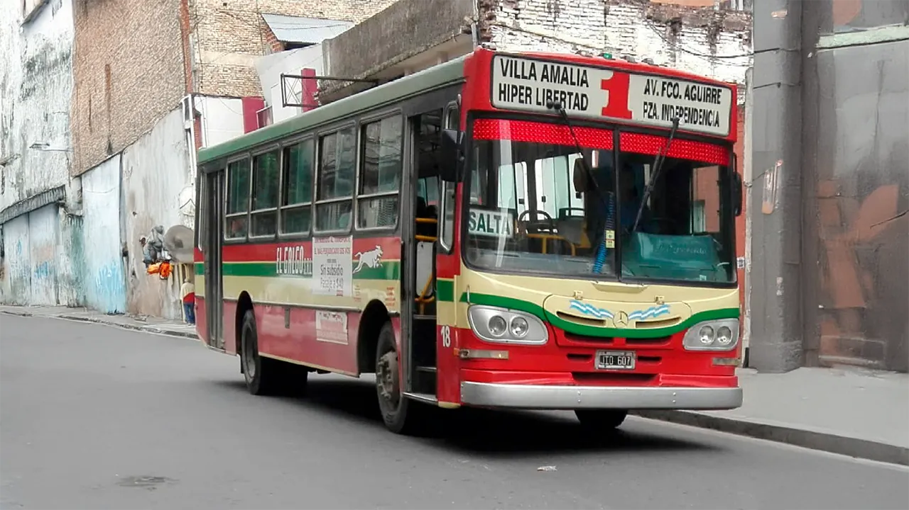

## Linea 1 - Salta

<p align="center"></p>

### Recorrido

```geojson
{"type":"FeatureCollection","features":[{"type":"Feature","properties":{"name":"Linea 1","direction":"Salta","category":"urbano","length_km":26.03},"geometry":{"coordinates":[[-65.22921892197176,-26.78757030469688],[-65.22908916340931,-26.78699828431006],[-65.22897633105923,-26.786426263923232],[-65.22884786692757,-26.785810629630404],[-65.22870247658273,-26.785091114359872],[-65.22760519533742,-26.785307111182327],[-65.22651637719827,-26.785507997948425],[-65.22518339146205,-26.785767633160845],[-65.22383136373685,-26.786021602076477],[-65.2241040591609,-26.787262338544156],[-65.22479382590662,-26.787143714994336],[-65.22506777137286,-26.788336403365165],[-65.22607384654228,-26.788163676609177],[-65.22622558383489,-26.78885147812484],[-65.22545155476146,-26.78899653144883],[-65.2246923584183,-26.789139547729214],[-65.22303305679579,-26.78943920739573],[-65.22251277420466,-26.789536501205816],[-65.22231123397968,-26.78964855982189],[-65.22168488341687,-26.78979973019613],[-65.22089447203663,-26.789976083676596],[-65.2194582449393,-26.79028059543011],[-65.21816889844393,-26.790583197033076],[-65.21731926832871,-26.79077341222821],[-65.21626396219979,-26.791012806317607],[-65.21507721251281,-26.791264103816548],[-65.21395878039354,-26.79148298598148],[-65.21263842049088,-26.791746080671253],[-65.21034866555357,-26.792204876018495],[-65.21053840092348,-26.79313557872439],[-65.21075290102243,-26.794047575527077],[-65.21088308229999,-26.79454706197073],[-65.21087704526904,-26.794622371276887],[-65.2107025786354,-26.795008615146727],[-65.21053382693871,-26.79537445391219],[-65.21052420544214,-26.795473102740353],[-65.21081176068411,-26.796695729925865],[-65.21101452573913,-26.79751807938556],[-65.21129348995653,-26.79867030513488],[-65.21178363212857,-26.800683083261482],[-65.21221162070495,-26.80244577964356],[-65.2125254296198,-26.803799795788134],[-65.2127945993144,-26.80490585176188],[-65.21314568310969,-26.806368968876754],[-65.21344480568706,-26.807709741185725],[-65.21373821332826,-26.809002905554767],[-65.21408752017119,-26.810397473996098],[-65.21440150866721,-26.81173783860806],[-65.21471514585518,-26.81308974730201],[-65.21504402287647,-26.814473957245077],[-65.2152978834317,-26.81550291971535],[-65.21533445969817,-26.81566115310972],[-65.21539389571397,-26.81579898503152],[-65.2155009562066,-26.815967419106343],[-65.21556020139131,-26.81606523706241],[-65.21551838726734,-26.816163449342554],[-65.21543656858178,-26.816222558970278],[-65.21532211755768,-26.816221230258755],[-65.21518861674227,-26.816165497891724],[-65.21503210389837,-26.816159440253234],[-65.21329034389215,-26.81649074792635],[-65.21046031763045,-26.81704859922787],[-65.20778078471812,-26.817574148768426],[-65.2078119680928,-26.81774434997483],[-65.20793459046465,-26.81821036683303],[-65.20845585410235,-26.82021090159339],[-65.20879614472699,-26.821560305444766],[-65.20920517837335,-26.822909951734587],[-65.20917538276815,-26.82298807013921],[-65.2093646597587,-26.823627191960462],[-65.20961087039964,-26.82449119717871],[-65.20985181753562,-26.825351346550697],[-65.21020187230805,-26.826768998916137],[-65.21053503752604,-26.828195443002045],[-65.21076010898226,-26.82919490549432],[-65.2110588784853,-26.830439537915243],[-65.21147049121065,-26.83210945613784],[-65.21165940801954,-26.832842685237893],[-65.2119285502075,-26.833840910879236],[-65.2125551013157,-26.836427787178394],[-65.2132743515234,-26.839267290114094],[-65.21361532418749,-26.840608630130117],[-65.2138829254529,-26.84162213911833],[-65.21391609249487,-26.841750890967408],[-65.21393518490848,-26.841879642816487],[-65.2138204401655,-26.84206841050201],[-65.21379684690106,-26.84216279434471],[-65.21380703274413,-26.842259689816355],[-65.21407797860525,-26.843382169238637],[-65.21431400781208,-26.844263913446014],[-65.2143730151138,-26.844500674595274],[-65.21444891196931,-26.844677157910198],[-65.21455003701892,-26.84499998575718],[-65.21484468573905,-26.846203046961026],[-65.21513933445917,-26.847406108164872],[-65.21475843971925,-26.847488411711314],[-65.21355613823546,-26.84772973552887],[-65.21252695467656,-26.847934642548804],[-65.21207311089697,-26.848022719233914],[-65.21223770860207,-26.84868830412867],[-65.21244453019051,-26.849515878426566],[-65.21268638315922,-26.85060102601337],[-65.21275154107471,-26.85089679379112],[-65.2112608367493,-26.85124410572413],[-65.2097132921781,-26.851607388677294],[-65.2098585341112,-26.852286152617214],[-65.2100445924655,-26.853106809907025],[-65.21031748671277,-26.85428868604164],[-65.21059351445733,-26.85545820998344],[-65.21073656562635,-26.85607637478462],[-65.21091198843962,-26.85684521781845],[-65.21119757089221,-26.858094317776608],[-65.21147106541865,-26.859272378693518],[-65.21162047984743,-26.8600183616122],[-65.21172907785403,-26.860542100684903],[-65.21026498984469,-26.860814774843334],[-65.20828404194882,-26.861208419968353],[-65.20684296946303,-26.861509466890293],[-65.20652064785419,-26.860309512063004],[-65.20621099341096,-26.859183637003042],[-65.2059649253984,-26.858269621961554],[-65.20585115888836,-26.857865393937264],[-65.20513875124834,-26.85801171602251],[-65.20440663912913,-26.8581505042802],[-65.2040962074524,-26.85697984347269],[-65.20403327173013,-26.85684505742641],[-65.2033046061019,-26.855905398595812],[-65.20323786182082,-26.855801361008723],[-65.20320208172195,-26.855692300771153],[-65.20308889116886,-26.85531264443518],[-65.20292784687986,-26.85479737590076],[-65.20450007639329,-26.854423897730367],[-65.20544848048692,-26.85420701566428],[-65.20530779650993,-26.853506682544015],[-65.20512488864908,-26.85270589353355],[-65.20494621631622,-26.85189374861179],[-65.20481821264525,-26.8513226981452],[-65.20452873407463,-26.849965470939793],[-65.20434031848178,-26.84915465360229],[-65.2041519028895,-26.84822956278754],[-65.20389927022087,-26.847305265274557],[-65.20361145068064,-26.846317317165934],[-65.20342804987115,-26.845553304150272],[-65.20334488462495,-26.845188287891148],[-65.20323779251193,-26.84458844015688],[-65.2031414033476,-26.844072795613343],[-65.20302812462955,-26.84361240594405],[-65.20281773097807,-26.842722532340773],[-65.20260733732657,-26.84182135484671],[-65.20233757737552,-26.840700830922415],[-65.20207344727596,-26.83960291186802],[-65.20186419707824,-26.838746856079432],[-65.20338413631043,-26.838417443012275],[-65.2048632591215,-26.83813952011718],[-65.20640923641574,-26.837795664644563],[-65.20797773311462,-26.837445529816854],[-65.20763212146767,-26.836017133362752],[-65.20746353803293,-26.835277817250862],[-65.20731465907689,-26.834616366345415],[-65.20698806653111,-26.83329738221533],[-65.2054001059033,-26.833580344349325],[-65.20389346601729,-26.833909937526712],[-65.20316055428485,-26.834119946702845],[-65.20244171718078,-26.83428474335951],[-65.20095237285535,-26.834624524349934],[-65.20065374480207,-26.833278449759334],[-65.20043822038639,-26.832385982330468],[-65.20018436151035,-26.831376167915813],[-65.19996428174188,-26.830532136451104],[-65.1997931170633,-26.82977587846181],[-65.199541055036,-26.828675224131693],[-65.1993101049517,-26.82771523712298],[-65.19895869310291,-26.826371641873774],[-65.19864700164902,-26.825066958437652],[-65.20020428865537,-26.824812272490433],[-65.20160675475226,-26.82455507452961],[-65.20309505122692,-26.824216610466596],[-65.20481047221791,-26.823832752491725],[-65.20718988446968,-26.82333797702313],[-65.2090992041445,-26.8229336351739],[-65.20886799494491,-26.822197990175876],[-65.20868141565514,-26.821579966453502],[-65.20834624799575,-26.820237727186804],[-65.2080302387887,-26.818967684988518],[-65.20783334879067,-26.818235596360957],[-65.20770823408516,-26.817765846704752],[-65.2076859882492,-26.81758851248399],[-65.20769359677705,-26.81737272229888],[-65.2076678443216,-26.817178157045763],[-65.20753090230497,-26.816614299796175],[-65.20734766710571,-26.815851108169856],[-65.20708976272284,-26.814740644633023],[-65.20681356132299,-26.813562348911606],[-65.2064424402136,-26.812179504330082],[-65.20593875515507,-26.81078525665347],[-65.20552943231068,-26.809500272551134],[-65.20519048260685,-26.808156247030254],[-65.20486123788072,-26.80686767421834],[-65.20460095883189,-26.80583662086779],[-65.20418211642365,-26.80423908474004],[-65.20392448178285,-26.803272056170314],[-65.20368373669584,-26.802379146266933],[-65.20341684231522,-26.801357101847607],[-65.20324305364421,-26.800685538822037],[-65.20327675615923,-26.80040225144718],[-65.20356098705268,-26.799600119257764],[-65.20383084546016,-26.79878834770173],[-65.20399413684898,-26.798131149826713],[-65.20413490883311,-26.79747143934862],[-65.20428694051955,-26.796789115168778],[-65.20444094309245,-26.79616478197084],[-65.20440742043493,-26.79613124528366],[-65.20438048661052,-26.796090651035392],[-65.20430003978976,-26.795819002317735],[-65.2042335553509,-26.795532530133467],[-65.2040914743221,-26.794925605477513],[-65.20257700788144,-26.795212565781426],[-65.20236906919325,-26.794309847361195],[-65.20222587379365,-26.793712420305226],[-65.2035593981303,-26.79345380339205],[-65.20813133308467,-26.79252091483114],[-65.21033380918479,-26.792115797215168],[-65.21261743474096,-26.791666154382586],[-65.21393449935556,-26.79139517401005],[-65.21504455826388,-26.79116836196668],[-65.21626091373501,-26.790912364437474],[-65.21729820117054,-26.790680173801043],[-65.21813900380413,-26.790497883214385],[-65.21943700141968,-26.79020335963008],[-65.22079095028231,-26.789893194810283],[-65.22165145758014,-26.789709510164336],[-65.22246341489318,-26.789546868888227],[-65.22268602447153,-26.790371705413516],[-65.22305591267988,-26.791603267174647],[-65.22331667371586,-26.79239790984947],[-65.22345789229294,-26.792283168784195],[-65.22368900418219,-26.79200812451128],[-65.22413175617642,-26.791487377305266],[-65.2249546154623,-26.790502221160043],[-65.22543839689335,-26.789911312459978],[-65.22616747477484,-26.78897082963571],[-65.22624224616293,-26.78885003078496],[-65.22608779315745,-26.788162215797687],[-65.2285729582075,-26.7877273294785]],"type":"LineString"}}]}
```

### Paradas

```geojson
{"type":"FeatureCollection","properties":{"name":"Linea 1 - Salta"},"features":[{"type":"Feature","geometry":{"type":"Point","coordinates":[-65.22910043847848,-26.787498533350952]},"properties":{"name":"Inicio de Recorrido"}},{"type":"Feature","geometry":{"type":"Point","coordinates":[-65.22890862620554,-26.786462149946658]},"properties":{"name":"Necochea y Los Ceibos"}},{"type":"Feature","geometry":{"type":"Point","coordinates":[-65.22873844478568,-26.785106224441158]},"properties":{"name":" Necochea y Av. Mercedes Sosa"}},{"type":"Feature","geometry":{"type":"Point","coordinates":[-65.2264888721015,-26.78552877423618]},"properties":{"name":"Av. Mercedes Sosa y Castelli"}},{"type":"Feature","geometry":{"type":"Point","coordinates":[-65.22383699358832,-26.78602537138507]},"properties":{"name":"Av. Mercedes Sosa y Rep�blica del L�bano"}},{"type":"Feature","geometry":{"type":"Point","coordinates":[-65.22408525995876,-26.787258143098253]},"properties":{"name":"Rep�blica del L�bano y Los Ceibos"}},{"type":"Feature","geometry":{"type":"Point","coordinates":[-65.22478677620522,-26.787135324092397]},"properties":{"name":"Los Ceibos y Bulnes"}},{"type":"Feature","geometry":{"type":"Point","coordinates":[-65.22515236778291,-26.788384650531327]},"properties":{"name":"Bulnes y Rep�blica del Libano"}},{"type":"Feature","geometry":{"type":"Point","coordinates":[-65.22600601439252,-26.788255530864763]},"properties":{"name":"Rep�blica del L�bano y Castelli"}},{"type":"Feature","geometry":{"type":"Point","coordinates":[-65.22622948507481,-26.788765848287078]},"properties":{"name":" Av. Fco de Aguirre y Diagonal"}},{"type":"Feature","geometry":{"type":"Point","coordinates":[-65.22476652206234,-26.789137510690708]},"properties":{"name":"Av. Fco de Aguirre y Castelli"}},{"type":"Feature","geometry":{"type":"Point","coordinates":[-65.22307070910757,-26.789442262945663]},"properties":{"name":"Av. Fco de Aguirre (VEA) y Saavedra"}},{"type":"Feature","geometry":{"type":"Point","coordinates":[-65.22089447203663,-26.789976083676596]},"properties":{"name":"(Ida)Av. Fco de Aguirre y J.J Paso"}},{"type":"Feature","geometry":{"type":"Point","coordinates":[-65.21963350301615,-26.79026359039974]},"properties":{"name":"(Vuelta) Av. F. de Aguirre y Thames"}},{"type":"Feature","geometry":{"type":"Point","coordinates":[-65.21829081710554,-26.79057299404253]},"properties":{"name":"(Vuelta) Av. F. de Aguirre y  Alberti"}},{"type":"Feature","geometry":{"type":"Point","coordinates":[-65.21751548117513,-26.790751305783342]},"properties":{"name":"(Vuelta) Av. F. de Aguirre y  P. de los Andes"}},{"type":"Feature","geometry":{"type":"Point","coordinates":[-65.21514007682298,-26.791248799422025]},"properties":{"name":"(Vuelta) Av. F. de Aguirre y San Miguel"}},{"type":"Feature","geometry":{"type":"Point","coordinates":[-65.21278319890177,-26.791708670085697]},"properties":{"name":"(Vuelta) Av. F. de Aguirre y L. C�rdoba"}},{"type":"Feature","geometry":{"type":"Point","coordinates":[-65.21034295061587,-26.792199774595602]},"properties":{"name":"(Ida)Av. Fco de Aguirre y Rep�blica del L�bano"}},{"type":"Feature","geometry":{"type":"Point","coordinates":[-65.21080052549922,-26.793940447346333]},"properties":{"name":" Av. Rep. de L�bano y Juan Cruz Varela"}},{"type":"Feature","geometry":{"type":"Point","coordinates":[-65.21090319968049,-26.796711033585524]},"properties":{"name":" Av. Rep. de Libano y Chazarreta"}},{"type":"Feature","geometry":{"type":"Point","coordinates":[-65.21133920945509,-26.79867030513488]},"properties":{"name":"Av. Rep. de L�bano y Don Orione"}},{"type":"Feature","geometry":{"type":"Point","coordinates":[-65.21193412547639,-26.800666079789124]},"properties":{"name":"Av. Rep. Libano y Mejico"}},{"type":"Feature","geometry":{"type":"Point","coordinates":[-65.21225162526504,-26.80230975391711]},"properties":{"name":"Av. Rep. Libano y Venezuela"}},{"type":"Feature","geometry":{"type":"Point","coordinates":[-65.21260543874158,-26.803900113461925]},"properties":{"name":"Av. Rep. de L�bano y Colombia"}},{"type":"Feature","geometry":{"type":"Point","coordinates":[-65.21319330758726,-26.80652539285513]},"properties":{"name":"Av. Rep. de Libano y Paraguay"}},{"type":"Feature","geometry":{"type":"Point","coordinates":[-65.21375154818188,-26.80890089217176]},"properties":{"name":"Av. Rep. Libano y Bolivia"}},{"type":"Feature","geometry":{"type":"Point","coordinates":[-65.21423229858209,-26.810730712989113]},"properties":{"name":"Av. Rep. Libano y Chile"}},{"type":"Feature","geometry":{"type":"Point","coordinates":[-65.21453485720423,-26.812060872576744]},"properties":{"name":"Av. Rep. Libano y Uruguay"}},{"type":"Feature","geometry":{"type":"Point","coordinates":[-65.21504783283443,-26.814319244375618]},"properties":{"name":"Av. Rep. Libano y  Espa�a"}},{"type":"Feature","geometry":{"type":"Point","coordinates":[-65.21538360749041,-26.815387311167903]},"properties":{"name":"Av. Rep. Libano y Plazoleta Mitre"}},{"type":"Feature","geometry":{"type":"Point","coordinates":[-65.21333606338996,-26.816541751211698]},"properties":{"name":"Av. Sarmiento y Suipacha"}},{"type":"Feature","geometry":{"type":"Point","coordinates":[-65.20798602490018,-26.818201866411307]},"properties":{"name":"Av. Salta 876"}},{"type":"Feature","geometry":{"type":"Point","coordinates":[-65.2086266015878,-26.82086838948432]},"properties":{"name":"Av. Salta y Corrientes"}},{"type":"Feature","geometry":{"type":"Point","coordinates":[-65.20937418465438,-26.8236169919427]},"properties":{"name":"Salta y San Juan"}},{"type":"Feature","geometry":{"type":"Point","coordinates":[-65.20995315485719,-26.825313666531137]},"properties":{"name":"Salta y Cordoba"}},{"type":"Feature","geometry":{"type":"Point","coordinates":[-65.21063355992273,-26.828181627343007]},"properties":{"name":"PC: Salta y San Martin"}},{"type":"Feature","geometry":{"type":"Point","coordinates":[-65.21110250983249,-26.830419442809916]},"properties":{"name":"Jujuy y Cris�stomo Alvarez"}},{"type":"Feature","geometry":{"type":"Point","coordinates":[-65.21191306811643,-26.833575914337946]},"properties":{"name":"Jujuy y Piedras"}},{"type":"Feature","geometry":{"type":"Point","coordinates":[-65.21272821924053,-26.836951486928356]},"properties":{"name":"Jujuy y Lavalle"}},{"type":"Feature","geometry":{"type":"Point","coordinates":[-65.2134699888529,-26.840019539450047]},"properties":{"name":"Jujuy y Rondeau"}},{"type":"Feature","geometry":{"type":"Point","coordinates":[-65.21413427711747,-26.843250310115465]},"properties":{"name":"Jujuy y Alsina"}},{"type":"Feature","geometry":{"type":"Point","coordinates":[-65.21461478030747,-26.844982404800074]},"properties":{"name":" Jujuy y La Plata"}},{"type":"Feature","geometry":{"type":"Point","coordinates":[-65.21464584269476,-26.84752608435579]},"properties":{"name":"Independencia y Jujuy"}},{"type":"Feature","geometry":{"type":"Point","coordinates":[-65.21244672929696,-26.847945944298974]},"properties":{"name":" Av. Independencia y Chacabuco"}},{"type":"Feature","geometry":{"type":"Point","coordinates":[-65.21250927347961,-26.849321239738224]},"properties":{"name":"Chacabuco y Larrea"}},{"type":"Feature","geometry":{"type":"Point","coordinates":[-65.21269482793613,-26.85060102601337]},"properties":{"name":"Chacabuco y Matheu"}},{"type":"Feature","geometry":{"type":"Point","coordinates":[-65.2113410621289,-26.851272987126595]},"properties":{"name":"Matheu y Buenos Aires"}},{"type":"Feature","geometry":{"type":"Point","coordinates":[-65.20967810560781,-26.851663895576586]},"properties":{"name":" Matheu y 9 de Julio"}},{"type":"Feature","geometry":{"type":"Point","coordinates":[-65.20996155215931,-26.852964916557134]},"properties":{"name":"9 de Julio y F. Garcia"}},{"type":"Feature","geometry":{"type":"Point","coordinates":[-65.21028652253122,-26.854214600927975]},"properties":{"name":"9 de Julio y Malabia"}},{"type":"Feature","geometry":{"type":"Point","coordinates":[-65.21051047415227,-26.855371568964465]},"properties":{"name":"9 de Julio y Lavaisse"}},{"type":"Feature","geometry":{"type":"Point","coordinates":[-65.21082050335767,-26.8566945395858]},"properties":{"name":"9 de Julio e Inca Garcilazo"}},{"type":"Feature","geometry":{"type":"Point","coordinates":[-65.21117364402426,-26.858056648653804]},"properties":{"name":" 9 de Julio y Av. Americo Vespucio"}},{"type":"Feature","geometry":{"type":"Point","coordinates":[-65.21179804353184,-26.860591069468917]},"properties":{"name":" PC: J. J. Olleros y 9 de Julio"}},{"type":"Feature","geometry":{"type":"Point","coordinates":[-65.21029595402625,-26.86075199447098]},"properties":{"name":"J. J. Olleros y Congreso"}},{"type":"Feature","geometry":{"type":"Point","coordinates":[-65.20837974941949,-26.861228509609237]},"properties":{"name":"J. J. Olleros y Las Heras"}},{"type":"Feature","geometry":{"type":"Point","coordinates":[-65.20695275156201,-26.861524534081976]},"properties":{"name":"J. J. Olleros y Moreno"}},{"type":"Feature","geometry":{"type":"Point","coordinates":[-65.2062433650558,-26.8593205000698]},"properties":{"name":"Moreno y A. Vespucio"}},{"type":"Feature","geometry":{"type":"Point","coordinates":[-65.20577234097149,-26.857925664634454]},"properties":{"name":"Moreno e Inca Garcilazo"}},{"type":"Feature","geometry":{"type":"Point","coordinates":[-65.20425885553495,-26.858056331499146]},"properties":{"name":"Marina Alfaro e Inca Garcilazo"}},{"type":"Feature","geometry":{"type":"Point","coordinates":[-65.20400049998173,-26.856991144318375]},"properties":{"name":"Marina Alfaro y Lavaisse"}},{"type":"Feature","geometry":{"type":"Point","coordinates":[-65.20319341654074,-26.855720816187972]},"properties":{"name":"Marina Alfaro y Malabia"}},{"type":"Feature","geometry":{"type":"Point","coordinates":[-65.20298133046664,-26.8549091308223]},"properties":{"name":" Marina Alfaro y F. Garcia"}},{"type":"Feature","geometry":{"type":"Point","coordinates":[-65.20442688832786,-26.854499238385383]},"properties":{"name":"F. Garcia y Moreno"}},{"type":"Feature","geometry":{"type":"Point","coordinates":[-65.20539640436338,-26.854258498550294]},"properties":{"name":" F. Garcia y Entre Rios"}},{"type":"Feature","geometry":{"type":"Point","coordinates":[-65.2051220737236,-26.852833974559832]},"properties":{"name":"Entre R�os y Matheu"}},{"type":"Feature","geometry":{"type":"Point","coordinates":[-65.20469998576931,-26.851490963484334]},"properties":{"name":"Entre R�os y Larrea"}},{"type":"Feature","geometry":{"type":"Point","coordinates":[-65.20447947287654,-26.85006969627019]},"properties":{"name":"Entre Rios e Independencia"}},{"type":"Feature","geometry":{"type":"Point","coordinates":[-65.20410967900506,-26.84842671485752]},"properties":{"name":"Entre Rios y Florida"}},{"type":"Feature","geometry":{"type":"Point","coordinates":[-65.2038950478327,-26.84727638286072]},"properties":{"name":"Entre Rios y La Plata"}},{"type":"Feature","geometry":{"type":"Point","coordinates":[-65.20323638504861,-26.844690158867184]},"properties":{"name":"Entre Rios y Av. Gral. Roca"}},{"type":"Feature","geometry":{"type":"Point","coordinates":[-65.20267771046714,-26.842038611128064]},"properties":{"name":"Entre Rios y Bolivar"}},{"type":"Feature","geometry":{"type":"Point","coordinates":[-65.20202277861519,-26.839610446922123]},"properties":{"name":"Entre Rios y Lamadrid"}},{"type":"Feature","geometry":{"type":"Point","coordinates":[-65.20037347709784,-26.832413612620588]},"properties":{"name":"Entre Rios y 24 de Septiembre"}},{"type":"Feature","geometry":{"type":"Point","coordinates":[-65.19978607974915,-26.82977587846181]},"properties":{"name":"Monteagudo y Mendoza"}},{"type":"Feature","geometry":{"type":"Point","coordinates":[-65.19902062146602,-26.826503520652704]},"properties":{"name":"Monteagudo y San Juan"}},{"type":"Feature","geometry":{"type":"Point","coordinates":[-65.20238850489923,-26.82438366007241]},"properties":{"name":"Santiago y 25 de Mayo"}},{"type":"Feature","geometry":{"type":"Point","coordinates":[-65.20507929761344,-26.82369333448846]},"properties":{"name":"Santiago y Mu�ecas"}},{"type":"Feature","geometry":{"type":"Point","coordinates":[-65.20886799494491,-26.822197990175876]},"properties":{"name":"Av. Salta y Corrientes (Vuelta)"}},{"type":"Feature","geometry":{"type":"Point","coordinates":[-65.2080073790394,-26.819059488883827]},"properties":{"name":"Av. Salta 876"}},{"type":"Feature","geometry":{"type":"Point","coordinates":[-65.20745181935328,-26.816330939556746]},"properties":{"name":"Av. Rep. de Siria y Espa�a"}},{"type":"Feature","geometry":{"type":"Point","coordinates":[-65.20685719267016,-26.813748256161308]},"properties":{"name":"(Vuelta) Av. Rep. de Siria y Uruguay"}},{"type":"Feature","geometry":{"type":"Point","coordinates":[-65.20639599394102,-26.81225612923202]},"properties":{"name":"(Vuelta) Av. Rep. de Siria y Chile"}},{"type":"Feature","geometry":{"type":"Point","coordinates":[-65.20595564470831,-26.81082670998781]},"properties":{"name":"(Vuelta) Av. Rep. de Siria y  Bolivia"}},{"type":"Feature","geometry":{"type":"Point","coordinates":[-65.20521300201152,-26.808255486076547]},"properties":{"name":"(Vuelta) Av. Rep. de Siria y Paraguay"}},{"type":"Feature","geometry":{"type":"Point","coordinates":[-65.20457140211305,-26.806089120151984]},"properties":{"name":"(Vuelta) Av. Rep. de Siria y Ecuador"}},{"type":"Feature","geometry":{"type":"Point","coordinates":[-65.2040596671596,-26.8041787854726]},"properties":{"name":"(Vuelta) Av. Rep. de Siria y Venezuela"}},{"type":"Feature","geometry":{"type":"Point","coordinates":[-65.20356832474596,-26.802352764909]},"properties":{"name":"(Vuelta) Av. Rep. de Siria y Mejico"}},{"type":"Feature","geometry":{"type":"Point","coordinates":[-65.20252493175795,-26.795238948799778]},"properties":{"name":"Av. Rep. de Siria y Madrid"}},{"type":"Feature","geometry":{"type":"Point","coordinates":[-65.20249254132574,-26.793652307119448]},"properties":{"name":"(Vuelta) Av. F. de Aguirre y Av. Rep. de Siria"}},{"type":"Feature","geometry":{"type":"Point","coordinates":[-65.20813133308467,-26.79252091483114]},"properties":{"name":"Av. Fco de Aguirre y Suipacha"}},{"type":"Feature","geometry":{"type":"Point","coordinates":[-65.21021189052317,-26.79203077341436]},"properties":{"name":"(Vuelta) Av. F. de Aguirre y Rep. del L�bano"}},{"type":"Feature","geometry":{"type":"Point","coordinates":[-65.21245170155974,-26.79165595148824]},"properties":{"name":"(Vuelta) Av. F. de Aguirre y L. C�rdoba"}},{"type":"Feature","geometry":{"type":"Point","coordinates":[-65.21384496533815,-26.79134585990269]},"properties":{"name":"(Vuelta) Av. F. de Aguirre y Asuncion"}},{"type":"Feature","geometry":{"type":"Point","coordinates":[-65.21495311926749,-26.791161560008174]},"properties":{"name":"(Vuelta) Av. F. de Aguirre y San Miguel"}},{"type":"Feature","geometry":{"type":"Point","coordinates":[-65.21723343188138,-26.79068357479477]},"properties":{"name":"(Vuelta) Av. F. de Aguirre y  P. de los Andes"}},{"type":"Feature","geometry":{"type":"Point","coordinates":[-65.22049377354381,-26.78991190040459]},"properties":{"name":"(Vuelta) Av. F. de Aguirre y J.J. Paso"}},{"type":"Feature","geometry":{"type":"Point","coordinates":[-65.22275460371864,-26.790370004911413]},"properties":{"name":"Av. Ejercito del Norte y Madrid"}},{"type":"Feature","geometry":{"type":"Point","coordinates":[-65.22327011149258,-26.792271173041218]},"properties":{"name":"Av. Ejercito del Norte y Diagonal"}},{"type":"Feature","geometry":{"type":"Point","coordinates":[-65.22529307781275,-26.790079186935415]},"properties":{"name":" Diagonal y Madrid"}},{"type":"Feature","geometry":{"type":"Point","coordinates":[-65.2263993833595,-26.788913379509015]},"properties":{"name":" Av. Fco de Aguirre y Diagonal"}}]}
```

### Editar en [`geojson.io`](https://geojson.io/#map=11/-26.8139/-65.2008)

- [recorrido.v2.geojson](https://geojson.io/#data=data:text/x-url,https%3A%2F%2Fraw.githubusercontent.com%2FFrancoJavierGadea%2FTucuman-colectivos%2Frefs%2Fheads%2Fmain%2Fdata%2Furbano%2F1%2Fsalta%2Frecorrido.v2.geojson)

- [recorrido.geojson](https://geojson.io/#data=data:text/x-url,https%3A%2F%2Fraw.githubusercontent.com%2FFrancoJavierGadea%2FTucuman-colectivos%2Frefs%2Fheads%2Fmain%2Fdata%2Furbano%2F1%2Fsalta%2Frecorrido.geojson)

- [paradas.geojson](https://geojson.io/#data=data:text/x-url,https%3A%2F%2Fraw.githubusercontent.com%2FFrancoJavierGadea%2FTucuman-colectivos%2Frefs%2Fheads%2Fmain%2Fdata%2Furbano%2F1%2Fsalta%2Fparadas.geojson)