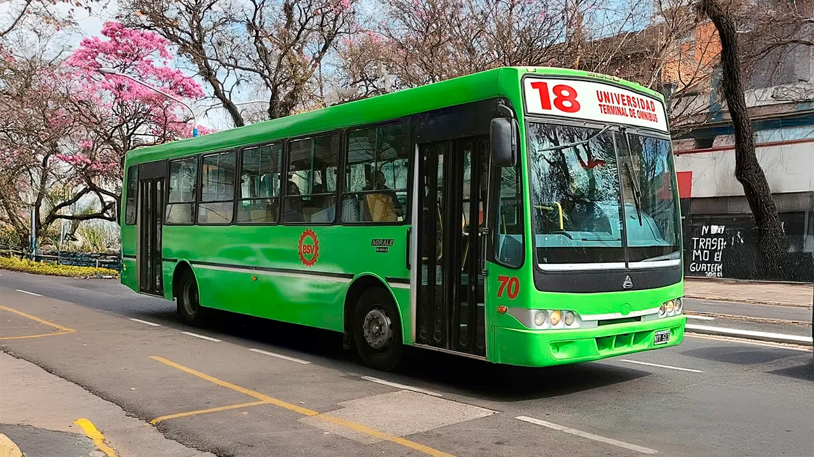

## Linea 18 - Antihorario

<p align="center"></p>

### Recorrido

```geojson
{"type":"FeatureCollection","features":[{"type":"Feature","properties":{"name":"Linea 18 - Antihorario"},"geometry":{"coordinates":[[-65.23684028205656,-26.843219274199438],[-65.23677127506241,-26.843261628243265],[-65.23669218732864,-26.843288774408713],[-65.23576224928793,-26.843468452627274],[-65.23402631760169,-26.843788234257577],[-65.2326331618507,-26.844057794716257],[-65.23153259077479,-26.844272807961232],[-65.22985603086211,-26.844577729648556],[-65.22821367942178,-26.84487936774764],[-65.22692171939063,-26.845122585597075],[-65.22549973789161,-26.845418552961704],[-65.22409216857109,-26.845713448703865],[-65.22282883954159,-26.84596229964731],[-65.22273118555727,-26.845980540576655],[-65.22257993937141,-26.845362186723275],[-65.22238905969657,-26.844588452715804],[-65.22210178300594,-26.843358380100728],[-65.22195204147029,-26.842708880168647],[-65.22175305832886,-26.841879349421955],[-65.2215823174655,-26.841215526119434],[-65.22142839080918,-26.84055170281691],[-65.2206397632764,-26.840722184229676],[-65.22000643792848,-26.840846645540054],[-65.21934014546503,-26.84097600968984],[-65.21847965743366,-26.84114011202441],[-65.21708070652872,-26.841399813939383],[-65.21538411469503,-26.841743722167614],[-65.21385510569465,-26.842031251191738],[-65.21231416010771,-26.842336032696096],[-65.21075673096377,-26.842628557610347],[-65.2093792047125,-26.842897709015176],[-65.20768849087159,-26.843255104560637],[-65.20614346700351,-26.84354634403237],[-65.204642399289,-26.8438326807445],[-65.20310463842176,-26.844120935508258],[-65.20164092021606,-26.844408258111294],[-65.2006788836606,-26.844578190042405],[-65.20061326563939,-26.8446128776518],[-65.20055375491911,-26.84468490115787],[-65.20054765254214,-26.844727068285746],[-65.20055445676265,-26.844768376526375],[-65.20055884441419,-26.844826841950116],[-65.20054822620712,-26.84488773062243],[-65.20051335087575,-26.844951589554903],[-65.20047915901284,-26.84499055367296],[-65.20037057864027,-26.8450370067509],[-65.2002324320384,-26.845036855312074],[-65.20013518538678,-26.84499317700461],[-65.20007341820991,-26.84490289415706],[-65.20005390501277,-26.844824478773287],[-65.20004129060236,-26.844681872093325],[-65.19994313175168,-26.84429465546787],[-65.19945030940522,-26.842277334004606],[-65.19908472460799,-26.840824584918707],[-65.19877162531822,-26.8395062145164],[-65.19842648583926,-26.838176350667165],[-65.19810188416612,-26.8367405993553],[-65.19777266073011,-26.83540641294855],[-65.19750048675844,-26.834283993153647],[-65.19742324488728,-26.833971369327614],[-65.19730622388217,-26.833918362006767],[-65.19688270365108,-26.83398216658783],[-65.19648060162592,-26.834051979025233],[-65.1963271687565,-26.834107215171255],[-65.19622551210456,-26.83417489148978],[-65.19606893725785,-26.834247007500824],[-65.19598219501897,-26.834274614390417],[-65.19520545559017,-26.834486567417947],[-65.19514031108817,-26.83449640444509],[-65.19509676514186,-26.83449865241896],[-65.19503101017723,-26.83448586170457],[-65.19498500707002,-26.834473244463574],[-65.19494330782209,-26.834448145936157],[-65.1948858034507,-26.834373196986476],[-65.19483253216592,-26.83413154089196],[-65.19475369231442,-26.833788093312315],[-65.1944892097323,-26.832692505286193],[-65.1942226410848,-26.83162271118733],[-65.1949169229789,-26.831467952251238],[-65.1955919341793,-26.831333255281468],[-65.19671070825873,-26.8311269133264],[-65.19656039347258,-26.83037655556538],[-65.19639241388313,-26.829613298954254],[-65.1961255574851,-26.828523802211063],[-65.19596322324627,-26.827861544276335],[-65.19586030697877,-26.827457233970858],[-65.19554167255001,-26.82616888736556],[-65.19537111409714,-26.825477422645285],[-65.19521982633795,-26.82485044605304],[-65.1949032966513,-26.823555233693167],[-65.19470488453024,-26.82273565459024],[-65.19454501379649,-26.82204218746248],[-65.19428848960361,-26.821023145056817],[-65.19407993295046,-26.820204065928344],[-65.19405765966792,-26.82007719257649],[-65.19531526665766,-26.819854496762073],[-65.1965728736474,-26.81960594834866],[-65.19813405534269,-26.81930328132523],[-65.19971213549393,-26.81902000384725],[-65.20125757282925,-26.81872835606534],[-65.20285611959835,-26.81842593634815],[-65.2046215686294,-26.818095258786357],[-65.20627838472558,-26.81777966193593],[-65.20755578769814,-26.817517782468606],[-65.20813203503445,-26.817420437690473],[-65.20871854880697,-26.817304768375973],[-65.21086859604155,-26.816892690463362],[-65.21215301815185,-26.81664298833487],[-65.21391494710815,-26.816288494100945],[-65.21503859287601,-26.8160729258245],[-65.21516646997954,-26.8160204672914],[-65.21558528290613,-26.8157679007451],[-65.21579913427941,-26.815703525674373],[-65.2161767865469,-26.815624818631747],[-65.21682610226743,-26.815498934893657],[-65.21786243774974,-26.815321455915367],[-65.21902082095748,-26.81510384708239],[-65.21971853966454,-26.814970290617634],[-65.22131407964271,-26.814674201578818],[-65.2229850965045,-26.814346581859475],[-65.22453838446152,-26.814058431810412],[-65.22603064855679,-26.81375738287342],[-65.22753613050111,-26.813487205001046],[-65.22855852935307,-26.813291452974475],[-65.22889789842831,-26.813225107961394],[-65.22900371660978,-26.813221723655253],[-65.2291025019867,-26.813247630376928],[-65.22922974470035,-26.813286890519596],[-65.22924680684194,-26.813361630734974],[-65.22927559032388,-26.813428002095137],[-65.22948319043974,-26.813843193354685],[-65.22976828379785,-26.81440786492842],[-65.2298476296713,-26.814588700654813],[-65.2299433854209,-26.814907620950848],[-65.23009035582653,-26.815401100391586],[-65.23032424458623,-26.81622207386134],[-65.23056431843085,-26.817065862992465],[-65.23075055579899,-26.81773876560995],[-65.23087942667914,-26.81819189220937],[-65.23107536462302,-26.818941877828525],[-65.23127130256691,-26.81969186344768],[-65.23137894117039,-26.820578409749196],[-65.23162351334508,-26.821870356871155],[-65.23180885016595,-26.822905544323486],[-65.2319550311477,-26.823771119655174],[-65.23205920162646,-26.82438399486929],[-65.23218025775031,-26.824991219339307],[-65.2323429120033,-26.82561185925783],[-65.23255633314342,-26.826429285272813],[-65.23285743000821,-26.827636052031078],[-65.23320459763553,-26.829025066236767],[-65.2335406049071,-26.830343313594494],[-65.23388323071887,-26.831668163325944],[-65.23443230042321,-26.833786259353133],[-65.23472348263813,-26.834947817018307],[-65.23498339753054,-26.835973835987687],[-65.2351892966464,-26.836761157418557],[-65.23539604073851,-26.837580165337073],[-65.2354466830979,-26.837792289473935],[-65.23561604634835,-26.838483606955762],[-65.23576097389017,-26.839069348141045],[-65.23602623237586,-26.840119957565097],[-65.23617852497222,-26.840710064298328],[-65.23633982019847,-26.841304761164494],[-65.23668458626143,-26.842624653163938],[-65.23683671428762,-26.843188940083166]],"type":"LineString"}}]}
```

### Paradas

```geojson
{"type":"FeatureCollection","properties":{"name":"Linea 18 - Antihorario"},"features":[{"type":"Feature","geometry":{"type":"Point","coordinates":[-65.23687336131955,-26.843030162492457]},"properties":{"name":"Av Colon e independencia"}},{"type":"Feature","geometry":{"type":"Point","coordinates":[-65.23593639643194,-26.843496314162078]},"properties":{"name":"Av independencia y Chiclana"}},{"type":"Feature","geometry":{"type":"Point","coordinates":[-65.23415842922823,-26.84381288093059]},"properties":{"name":"Av independencia y Amador Lucero"}},{"type":"Feature","geometry":{"type":"Point","coordinates":[-65.23283493233463,-26.844033148096983]},"properties":{"name":"Av independencia y Matienzo "}},{"type":"Feature","geometry":{"type":"Point","coordinates":[-65.23166230037188,-26.844314599963724]},"properties":{"name":"Av independencia y Pellegrini"}},{"type":"Feature","geometry":{"type":"Point","coordinates":[-65.23007821859764,-26.844534866153943]},"properties":{"name":"Av independencia y Frias Silva"}},{"type":"Feature","geometry":{"type":"Point","coordinates":[-65.22841184686109,-26.844840790707178]},"properties":{"name":"Av independencia y Libertad "}},{"type":"Feature","geometry":{"type":"Point","coordinates":[-65.22712949494863,-26.845073292814725]},"properties":{"name":"Av Independencia y Prospero Mena"}},{"type":"Feature","geometry":{"type":"Point","coordinates":[-65.22426991875876,-26.845697375058048]},"properties":{"name":"Av Independencia y Miguel Lilio "}},{"type":"Feature","geometry":{"type":"Point","coordinates":[-65.22301499683373,-26.845966585943962]},"properties":{"name":"Av Alem e Independencia"}},{"type":"Feature","geometry":{"type":"Point","coordinates":[-65.22234222012021,-26.844769550781578]},"properties":{"name":"Av Alem y Florida "}},{"type":"Feature","geometry":{"type":"Point","coordinates":[-65.22201651095578,-26.84341731801194]},"properties":{"name":"Av Alem y Plata "}},{"type":"Feature","geometry":{"type":"Point","coordinates":[-65.22169420860344,-26.842063666655736]},"properties":{"name":"Av Alem y Alsina "}},{"type":"Feature","geometry":{"type":"Point","coordinates":[-65.21884563874399,-26.841157404144028]},"properties":{"name":"Av Roca y Bernabe Araoz"}},{"type":"Feature","geometry":{"type":"Point","coordinates":[-65.21695982710798,-26.84132872710655]},"properties":{"name":"Av Roca y Alberdi"}},{"type":"Feature","geometry":{"type":"Point","coordinates":[-65.21451170072963,-26.841965067269083]},"properties":{"name":"Av Roca entre La Rioja y Jujuy"}},{"type":"Feature","geometry":{"type":"Point","coordinates":[-65.21151497460261,-26.842479031712507]},"properties":{"name":"Av Roca entre Ayacucho y Chacabuco "}},{"type":"Feature","geometry":{"type":"Point","coordinates":[-65.20857310845045,-26.843103128257102]},"properties":{"name":"Av Roca entre Congreso y Las Heras"}},{"type":"Feature","geometry":{"type":"Point","coordinates":[-65.20552152234855,-26.843690510097563]},"properties":{"name":"Av Roca entre Congreso y Las Heras"}},{"type":"Feature","geometry":{"type":"Point","coordinates":[-65.20241507627179,-26.84432683698565]},"properties":{"name":"Av Roca entre Moreno y Entre Rios"}},{"type":"Feature","geometry":{"type":"Point","coordinates":[-65.19999437988085,-26.844706184005716]},"properties":{"name":"Plazoleta Dorrego"}},{"type":"Feature","geometry":{"type":"Point","coordinates":[-65.19942520764161,-26.84240560836345]},"properties":{"name":"Av Saenz Pena y Julio Prebisch "}},{"type":"Feature","geometry":{"type":"Point","coordinates":[-65.1988697503961,-26.840019323598188]},"properties":{"name":"Av Saenz Pena entre Rawson y F Ameghino "}},{"type":"Feature","geometry":{"type":"Point","coordinates":[-65.19820457320087,-26.837314806734437]},"properties":{"name":"Av Saenz Pena entre Jose Ingenieros y Domingo Garcia"}},{"type":"Feature","geometry":{"type":"Point","coordinates":[-65.19747082103704,-26.83435322549056]},"properties":{"name":"Av Saenz Pena y Charcas "}},{"type":"Feature","geometry":{"type":"Point","coordinates":[-65.19473467979063,-26.833900414921004]},"properties":{"name":"Parada Nueva Terminal de Omnibus"}},{"type":"Feature","geometry":{"type":"Point","coordinates":[-65.19644219650831,-26.829898469838188]},"properties":{"name":"Av Avellaneda entre Rio de Janeiro y Amadeo Jacques"}},{"type":"Feature","geometry":{"type":"Point","coordinates":[-65.19590045425653,-26.827462966165722]},"properties":{"name":"Av Avellaneda entre Cuba y Guatemala"}},{"type":"Feature","geometry":{"type":"Point","coordinates":[-65.19519413208012,-26.82488054076027]},"properties":{"name":"Av Avellaneda entre Haiti y Honduras"}},{"type":"Feature","geometry":{"type":"Point","coordinates":[-65.19452895488489,-26.822285817092805]},"properties":{"name":"Parada Centro de Salud "}},{"type":"Feature","geometry":{"type":"Point","coordinates":[-65.19656563145176,-26.819556397417493]},"properties":{"name":"Av Sarmiento entre Balcarce y Monteagudo"}},{"type":"Feature","geometry":{"type":"Point","coordinates":[-65.19960350255994,-26.819017849447576]},"properties":{"name":"Av Sarmiento entre Rivadavia y Laprida "}},{"type":"Feature","geometry":{"type":"Point","coordinates":[-65.20260022868696,-26.818393620189298]},"properties":{"name":"Av Sarmiento entre 25 de Mayo y Munecas"}},{"type":"Feature","geometry":{"type":"Point","coordinates":[-65.20554209483912,-26.817855066693994]},"properties":{"name":"Av Sarmiento entre Junin y Maipu"}},{"type":"Feature","geometry":{"type":"Point","coordinates":[-65.20864854091586,-26.81721859108207]},"properties":{"name":"Av Sarmiento entre Salta y Catamarca"}},{"type":"Feature","geometry":{"type":"Point","coordinates":[-65.21294819144595,-26.81641075150442]},"properties":{"name":"Av Sarmiento entre Marco Avellaneda y Suipacha "}},{"type":"Feature","geometry":{"type":"Point","coordinates":[-65.21811188658015,-26.815235701840585]},"properties":{"name":"Av Belgrano y Lucas Cordoba"}},{"type":"Feature","geometry":{"type":"Point","coordinates":[-65.2195451034235,-26.815027618859727]},"properties":{"name":"Av Belgrano y Asuncion"}},{"type":"Feature","geometry":{"type":"Point","coordinates":[-65.22272012446884,-26.814366646857394]},"properties":{"name":"Av Belgrano y Paso de los Andes "}},{"type":"Feature","geometry":{"type":"Point","coordinates":[-65.22585400053303,-26.81373015165694]},"properties":{"name":"Av Belgrano y Thames"}},{"type":"Feature","geometry":{"type":"Point","coordinates":[-65.2272872173764,-26.813424143076908]},"properties":{"name":"Av Belgrano y J J Passo"}},{"type":"Feature","geometry":{"type":"Point","coordinates":[-65.22977648873592,-26.814391127370676]},"properties":{"name":"Av Ejercito del Norte y Santa Fe"}},{"type":"Feature","geometry":{"type":"Point","coordinates":[-65.23015365106312,-26.815394823862352]},"properties":{"name":"Av Ejercito del Norte y Marcos Paz"}},{"type":"Feature","geometry":{"type":"Point","coordinates":[-65.23065424833376,-26.817047231652865]},"properties":{"name":"Av Ejercito del Norte y Corrientes "}},{"type":"Feature","geometry":{"type":"Point","coordinates":[-65.23093540570494,-26.818173303159718]},"properties":{"name":"Av Ejercito del Norte y Santiago"}},{"type":"Feature","geometry":{"type":"Point","coordinates":[-65.23140171549132,-26.820339735350885]},"properties":{"name":"Av Ejercito del Norte y Don Bosco "}},{"type":"Feature","geometry":{"type":"Point","coordinates":[-65.2316691578688,-26.82168608477286]},"properties":{"name":"Av Ejercito del Norte y Mendoza"}},{"type":"Feature","geometry":{"type":"Point","coordinates":[-65.23190231276199,-26.822897785576284]},"properties":{"name":"Av Ejercito del Norte y San Martin "}},{"type":"Feature","geometry":{"type":"Point","coordinates":[-65.23204632019599,-26.823815732104332]},"properties":{"name":"Av Ejercito del Norte y Pie Miguel Cane"}},{"type":"Feature","geometry":{"type":"Point","coordinates":[-65.23258806244779,-26.826226836230898]},"properties":{"name":"Av Colon y Crisostomo Alvarez "}},{"type":"Feature","geometry":{"type":"Point","coordinates":[-65.23291295629072,-26.827630389186414]},"properties":{"name":"Av Colon y San Lorenzo "}},{"type":"Feature","geometry":{"type":"Point","coordinates":[-65.23328868029155,-26.829026481929937]},"properties":{"name":"Av Colon y Las Piedras "}},{"type":"Feature","geometry":{"type":"Point","coordinates":[-65.23358433196434,-26.83034560887099]},"properties":{"name":"Av Colon y Gral. Paz"}},{"type":"Feature","geometry":{"type":"Point","coordinates":[-65.23392309950607,-26.831664720450853]},"properties":{"name":"Av Colon y Lamadrid "}},{"type":"Feature","geometry":{"type":"Point","coordinates":[-65.23442201170394,-26.833786259353133]},"properties":{"name":"Av Colon y Lavalle "}},{"type":"Feature","geometry":{"type":"Point","coordinates":[-65.23476077924566,-26.83492945554966]},"properties":{"name":"Av Colon y Bolivar "}},{"type":"Feature","geometry":{"type":"Point","coordinates":[-65.23522273498439,-26.836699188440804]},"properties":{"name":"Av Colon y Agustin Garcia"}},{"type":"Feature","geometry":{"type":"Point","coordinates":[-65.23573396600192,-26.83885360854594]},"properties":{"name":"Av Colon y Alsina"}},{"type":"Feature","geometry":{"type":"Point","coordinates":[-65.23604809590425,-26.84011766248663]},"properties":{"name":"Av Colon y Plata"}},{"type":"Feature","geometry":{"type":"Point","coordinates":[-65.2363745446263,-26.841304761164494]},"properties":{"name":"Av Colon y Florida"}}]}
```

### Editar en [`geojson.io`](https://geojson.io/#map=11/-26.8139/-65.2008)

- [recorrido.v2.geojson](https://geojson.io/#data=data:text/x-url,https%3A%2F%2Fraw.githubusercontent.com%2FFrancoJavierGadea%2FTucuman-colectivos%2Frefs%2Fheads%2Fmain%2Fdata%2Furbano%2F18%2Fantihorario%2Frecorrido.v2.geojson)

- [recorrido.geojson](https://geojson.io/#data=data:text/x-url,https%3A%2F%2Fraw.githubusercontent.com%2FFrancoJavierGadea%2FTucuman-colectivos%2Frefs%2Fheads%2Fmain%2Fdata%2Furbano%2F18%2Fantihorario%2Frecorrido.geojson)

- [paradas.geojson](https://geojson.io/#data=data:text/x-url,https%3A%2F%2Fraw.githubusercontent.com%2FFrancoJavierGadea%2FTucuman-colectivos%2Frefs%2Fheads%2Fmain%2Fdata%2Furbano%2F18%2Fantihorario%2Fparadas.geojson)