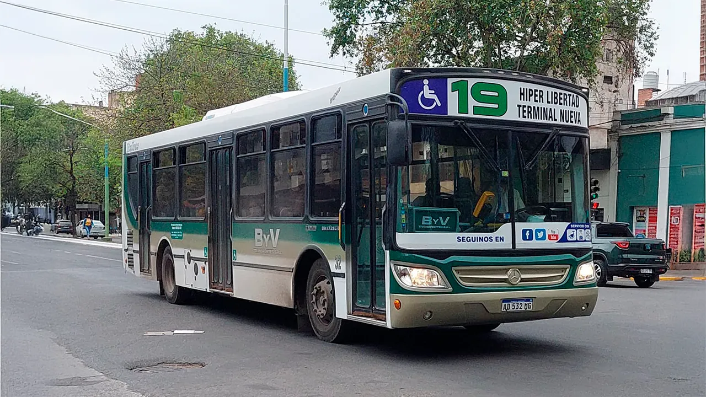

## Linea 19 - Antihorario

<p align="center"></p>

### Recorrido

```geojson
{"type":"FeatureCollection","features":[{"type":"Feature","properties":{"name":"Linea 19 - Anti horario"},"geometry":{"coordinates":[[-65.24445361813873,-26.792895139821187],[-65.24479154765534,-26.794434870577497],[-65.24496772592886,-26.795251748884844],[-65.24527769165503,-26.79668582500718],[-65.24563830001836,-26.79824049366185],[-65.2458676216284,-26.799249398686456],[-65.24623234028208,-26.800878819478516],[-65.24656167185594,-26.80239139441334],[-65.24688724394568,-26.80384993457924],[-65.24705024729838,-26.804592082055795],[-65.24723557036525,-26.8055608731281],[-65.2473317388321,-26.80601511312406],[-65.2473807101497,-26.806178139037492],[-65.24743724478445,-26.806320875120562],[-65.24755380235288,-26.806606611394113],[-65.24760447069204,-26.806727256356645],[-65.24764143568439,-26.806852416711855],[-65.24793805851225,-26.807872270093636],[-65.24806069244701,-26.80838897970419],[-65.248320314388,-26.809428709961633],[-65.24861505014891,-26.810648926815876],[-65.24884186999384,-26.811711236094585],[-65.24912576817532,-26.813028258767215],[-65.24931211404554,-26.81393093711975],[-65.24948134408858,-26.814676922035027],[-65.2496220851084,-26.815245943576222],[-65.24988460957388,-26.816368833963473],[-65.25010547459306,-26.81740797790566],[-65.25036196452854,-26.81859174045423],[-65.25063024244957,-26.81976423854042],[-65.25073683651325,-26.82025387162549],[-65.25080243351998,-26.820407362712622],[-65.25090287974152,-26.820668611112332],[-65.25098538975094,-26.82090470614118],[-65.25103275544012,-26.821035900167136],[-65.25116723987338,-26.821475793504884],[-65.25146439421643,-26.822458478342508],[-65.25192086920289,-26.824037235537883],[-65.2521806694243,-26.82492349614015],[-65.2524173993538,-26.82581387427981],[-65.25285216994763,-26.82742929237189],[-65.2532736249591,-26.828964579863666],[-65.25351275977901,-26.82982944419977],[-65.2536490548766,-26.830335625783462],[-65.25379609279226,-26.830939040031858],[-65.25418327610369,-26.83248255415698],[-65.25446316366786,-26.83353736437985],[-65.25452864544575,-26.83379582885445],[-65.25457758011163,-26.834037418682428],[-65.25439796480156,-26.83405634062481],[-65.25396581431929,-26.83414145747455],[-65.25353686330251,-26.834215154572128],[-65.25202262557279,-26.83446854617079],[-65.25126806091089,-26.83459893325921],[-65.24986400471751,-26.8348492270841],[-65.24779816836785,-26.835215633145328],[-65.24665787903538,-26.835413990805357],[-65.24670563797125,-26.83574965321644],[-65.24681167266739,-26.83664512506384],[-65.24687709925728,-26.837177170733067],[-65.2479490296634,-26.836992867432055],[-65.24898750814657,-26.83681165190747],[-65.24922301223823,-26.837686601373132],[-65.24947291982281,-26.838561550838794],[-65.25012184972715,-26.840897707435424],[-65.2502194593231,-26.841280679993638],[-65.2502454063187,-26.841391204672764],[-65.24871859229529,-26.841461705872668],[-65.24796972552143,-26.841500199892437],[-65.24714815755844,-26.84156649460717],[-65.24689544435458,-26.84160497054118],[-65.24667824433767,-26.841647093393156],[-65.24612993487796,-26.8417516664008],[-65.24519532047444,-26.841942743673023],[-65.24359842339422,-26.842271735667683],[-65.24156993615743,-26.84268316573226],[-65.24027601035688,-26.842946641659054],[-65.23891500456118,-26.843230444481797],[-65.23800868034321,-26.843420011975653],[-65.23713020065185,-26.843605062206024],[-65.23704322088477,-26.84360234714676],[-65.23695624111771,-26.84358745733838],[-65.23674914118386,-26.843273245742107],[-65.23604035655679,-26.84341302087186],[-65.23424689972214,-26.84374537155808],[-65.23172370465942,-26.84423565097655],[-65.23010063645158,-26.84453557639133],[-65.22854099042264,-26.84482228237067],[-65.2269258555139,-26.845119818314647],[-65.2251462102001,-26.845495336088746],[-65.2240907850202,-26.84571528652369],[-65.2231161866586,-26.845903686307786],[-65.22285499277521,-26.84595517260681],[-65.22272667001927,-26.845980239395395],[-65.22260592788204,-26.845997189854245],[-65.22147116346599,-26.846221635043086],[-65.22033823489703,-26.84642953711211],[-65.21898129391315,-26.846660774878902],[-65.21829970089259,-26.846788930657922],[-65.21766494579592,-26.846919872411558],[-65.21636117107204,-26.847177276828717],[-65.21503866117831,-26.84743189507447],[-65.21355965801995,-26.847727336519938],[-65.21242881675533,-26.847955914878476],[-65.21207155240104,-26.848024376076655],[-65.2124433058325,-26.84951850682055],[-65.21275166086768,-26.85090061704606],[-65.21123340597883,-26.851251247614897],[-65.2097091089493,-26.851607188109927],[-65.20810745811893,-26.85199132763745],[-65.20662824123585,-26.852340948094323],[-65.20511640666868,-26.852672363252367],[-65.20403760524576,-26.852944810783217],[-65.20247537308433,-26.85331577304908],[-65.20217452133075,-26.852304734191502],[-65.20190940443293,-26.85144817998132],[-65.20164532591937,-26.850588507368556],[-65.20165801752721,-26.85052955402652],[-65.2017034030298,-26.850491435749937],[-65.2022068013976,-26.85037113150289],[-65.2019793406845,-26.849595965795952],[-65.20152153737733,-26.848099742516432],[-65.20132809376905,-26.84746516116818],[-65.20107672657056,-26.846592536814864],[-65.2008787289211,-26.845871860660644],[-65.20072048690693,-26.84525759734405],[-65.20067156014622,-26.84507400403492],[-65.20059292880835,-26.845005262273467],[-65.20055054376355,-26.844988692249053],[-65.20051016763696,-26.84498451512809],[-65.20045904869227,-26.844998138870974],[-65.2003851880451,-26.84503136004048],[-65.2003036539562,-26.84504678035215],[-65.20009301044132,-26.845109799464286],[-65.19888997280982,-26.84544987326698],[-65.19768551225295,-26.845812799396924],[-65.19764247196507,-26.845758807660303],[-65.19759391622755,-26.84563659396099],[-65.19754820634185,-26.845438205922445],[-65.19705836699015,-26.843322515401642],[-65.19679417452174,-26.842225903464527],[-65.19652750237836,-26.84113367051761],[-65.19630636822104,-26.84017266433436],[-65.196044732935,-26.839103244360214],[-65.19593663908543,-26.838710277126438],[-65.1957925711528,-26.838077331558644],[-65.19553698326627,-26.837072818202817],[-65.19539197122985,-26.836459216970226],[-65.19522536590117,-26.835826348067705],[-65.19485836230687,-26.834243601550142],[-65.19467362966887,-26.833448025809947],[-65.19452538484522,-26.8328368729361],[-65.19436714198817,-26.832229400611787],[-65.19422243776542,-26.831621928287472],[-65.19526211222359,-26.831394262877183],[-65.19578557983748,-26.83129749623675],[-65.19671367608055,-26.83112384643247],[-65.1965640922994,-26.830378591125353],[-65.19626071628595,-26.82906208921244],[-65.19587691690951,-26.82751010695624],[-65.19561704329226,-26.826463392922385],[-65.19512428928404,-26.82446307603138],[-65.19462956156924,-26.822411887786767],[-65.19421992425144,-26.820733414838237],[-65.19377841313755,-26.81896830240398],[-65.19345372605153,-26.817558743990517],[-65.19297036109884,-26.815529004883125],[-65.19268461329833,-26.81434121285484],[-65.19232645481974,-26.812747489650604],[-65.19185452390316,-26.81074752333348],[-65.19158540502553,-26.809629622773972],[-65.19124161263365,-26.808184548797282],[-65.1908621926342,-26.806612261235163],[-65.19050907663485,-26.805128603396927],[-65.1901787282929,-26.803791504357733],[-65.18984226779656,-26.802338024465534],[-65.1895304265422,-26.801001570038586],[-65.18924710867209,-26.79983605966771],[-65.18896048890421,-26.798610192600087],[-65.18866571959741,-26.797458886803152],[-65.18851644829132,-26.796749523246206],[-65.1884247957794,-26.796443886869994],[-65.18851574441953,-26.796401289621713],[-65.18869277440639,-26.796345135417642],[-65.18954271020569,-26.7961738393552],[-65.19176381996368,-26.79572474203482],[-65.19328536725038,-26.795449178184782],[-65.19443677308892,-26.79524236896662],[-65.1955359564946,-26.795031477707937],[-65.19697536315388,-26.794755200068337],[-65.19777824356494,-26.794601543383436],[-65.19900424771637,-26.79434543558312],[-65.20028110263551,-26.79409622853676],[-65.20123326530756,-26.79390418646181],[-65.20222482816565,-26.793716731762565],[-65.20356699560817,-26.793451165123237],[-65.20524908348195,-26.793105144703127],[-65.20772740598557,-26.79260159588345],[-65.20959370899847,-26.792249671792284],[-65.21086833604764,-26.792009592039825],[-65.21219704134703,-26.791751122486588],[-65.21393891537757,-26.791393788587033],[-65.21505155760399,-26.791169275068633],[-65.21628045518914,-26.790907699642155],[-65.21729765701978,-26.79068020546739],[-65.2177939011939,-26.790577405885468],[-65.21901221316715,-26.790297966041035],[-65.21982797161955,-26.790115167451823],[-65.22081591860447,-26.78988516738231],[-65.2214744076481,-26.7897561861556],[-65.22252034876466,-26.789536912179948],[-65.22374416249454,-26.789312613475705],[-65.22441496866207,-26.789191810379258],[-65.22505526775724,-26.78907427515555],[-65.22615770464563,-26.788867526761976],[-65.22738738144808,-26.788641596071948],[-65.22826702123588,-26.788479611482266],[-65.2290551398075,-26.788332877273096],[-65.2296459770771,-26.78822570926197],[-65.23023861751962,-26.788113712245913],[-65.23112276862864,-26.787952494692046],[-65.23143659355283,-26.787896231992185],[-65.23212277355842,-26.787758681580414],[-65.23264775856813,-26.787651274456554],[-65.23277514408353,-26.787629179359158],[-65.23302630876988,-26.78758820850258],[-65.23413222490883,-26.78740581311928],[-65.23525355851247,-26.787214242359934],[-65.23593278963268,-26.787095115152827],[-65.23672462530924,-26.78695732830612],[-65.23743454849553,-26.7868324673723],[-65.23799882746496,-26.786737100493077],[-65.23868775564243,-26.786608966549622],[-65.23937760683246,-26.786473898973078],[-65.24007959504034,-26.786334617871123],[-65.24038527450708,-26.786276193632872],[-65.24044902100886,-26.786462757706058],[-65.24052635558435,-26.786689664221115],[-65.24058346179616,-26.786835913137914],[-65.24075049408019,-26.787293419457317],[-65.24093208253302,-26.787802791945673],[-65.24104637573626,-26.788191362731887],[-65.24106623673431,-26.788319602485196],[-65.2411259045594,-26.788702491067504],[-65.24118852582207,-26.789083131793802],[-65.24121499753838,-26.789249657942822],[-65.24164985009745,-26.78916693211051],[-65.24207007853626,-26.789088257676774],[-65.24231950595926,-26.789242262487242],[-65.24252909526224,-26.789373759468738],[-65.24258698701532,-26.7896431132852],[-65.24267132463352,-26.79004584979284],[-65.24277666517833,-26.790587374787204],[-65.24280860286412,-26.790712433809638],[-65.24289185521818,-26.79076288953728],[-65.24264802725396,-26.791075432861007],[-65.24262293911646,-26.791129478447623],[-65.24264705722256,-26.791462493528492],[-65.24270538732381,-26.792098806753984],[-65.2427411552778,-26.792418873565982],[-65.24322372978051,-26.792706534502305],[-65.2437163070834,-26.793000892243324],[-65.24406378855358,-26.79294042916631],[-65.24442389818788,-26.792877151734643]],"type":"LineString"}}]}
```

### Paradas

```geojson
{"type":"FeatureCollection","properties":{"name":"Linea 19 - Anti horario"},"features":[{"type":"Feature","geometry":{"type":"Point","coordinates":[-65.24484531270693,-26.79442482568225]},"properties":{"name":"Av America esquina Mexico"}},{"type":"Feature","geometry":{"type":"Point","coordinates":[-65.24554401621154,-26.7976199778944]},"properties":{"name":"Av America esquina Pje Homerg"}},{"type":"Feature","geometry":{"type":"Point","coordinates":[-65.24632141896373,-26.800887993681012]},"properties":{"name":"Av America 1535 - pje Pedro de Valdivia"}},{"type":"Feature","geometry":{"type":"Point","coordinates":[-65.24665760274418,-26.802388336385427]},"properties":{"name":"Av America 1415 - Bolivia"}},{"type":"Feature","geometry":{"type":"Point","coordinates":[-65.24703114027803,-26.804115979155817]},"properties":{"name":"Av America Esquina Chile"}},{"type":"Feature","geometry":{"type":"Point","coordinates":[-65.24742505258641,-26.80597695437971]},"properties":{"name":"Av Am�rica 1135 - Pje Zuvir�a"}},{"type":"Feature","geometry":{"type":"Point","coordinates":[-65.24799894207024,-26.807750004969012]},"properties":{"name":"Av Am�rica 1030 - Espa�a"}},{"type":"Feature","geometry":{"type":"Point","coordinates":[-65.2486645180396,-26.81035345977781]},"properties":{"name":"Av Am�rica 637 - pasaje Houssay"}},{"type":"Feature","geometry":{"type":"Point","coordinates":[-65.2491942621784,-26.81302656071799]},"properties":{"name":"Av America 600 esq Pje Dr Vallejo"}},{"type":"Feature","geometry":{"type":"Point","coordinates":[-65.24970023574694,-26.815090442472645]},"properties":{"name":"Av Am�rica 433 - Pasaje Jos� Carman"}},{"type":"Feature","geometry":{"type":"Point","coordinates":[-65.250070377485,-26.81683304465082]},"properties":{"name":"Av America 295 - esquina Don Bosco"}},{"type":"Feature","geometry":{"type":"Point","coordinates":[-65.25033864535024,-26.818118007182406]},"properties":{"name":"Av America 177- Mendoza"}},{"type":"Feature","geometry":{"type":"Point","coordinates":[-65.25064766276458,-26.819372649937108]},"properties":{"name":"Av America 100 - Mendoza"}},{"type":"Feature","geometry":{"type":"Point","coordinates":[-65.25201277266102,-26.82400319184723]},"properties":{"name":"Av Adolfo de La Vega 298 - San Lorenzo"}},{"type":"Feature","geometry":{"type":"Point","coordinates":[-65.25252553782111,-26.825769899785584]},"properties":{"name":"Av Adolfo de La Vega 356 Las Piedras"}},{"type":"Feature","geometry":{"type":"Point","coordinates":[-65.25334052880407,-26.828709301344702]},"properties":{"name":"Av Adolfo de La Vega 542 y Pie B Sur Mer"}},{"type":"Feature","geometry":{"type":"Point","coordinates":[-65.25389064771755,-26.830927438420467]},"properties":{"name":"Av Adofo de la Vega y Lavalle"}},{"type":"Feature","geometry":{"type":"Point","coordinates":[-65.25196183572466,-26.834548484165232]},"properties":{"name":"Av.Kirchner y Gorriti"}},{"type":"Feature","geometry":{"type":"Point","coordinates":[-65.24781896489479,-26.835224197876077]},"properties":{"name":"Av Kirchner 3137 - Diego de Rojas"}},{"type":"Feature","geometry":{"type":"Point","coordinates":[-65.24680022616614,-26.835790824651347]},"properties":{"name":"Lincoln 930 - Kirchner"}},{"type":"Feature","geometry":{"type":"Point","coordinates":[-65.24692587060936,-26.836978610616214]},"properties":{"name":"Alsina y Lincoln"}},{"type":"Feature","geometry":{"type":"Point","coordinates":[-65.24952705016322,-26.838478475605054]},"properties":{"name":"Diego de Rojas 1119"}},{"type":"Feature","geometry":{"type":"Point","coordinates":[-65.25025375045635,-26.841114553806996]},"properties":{"name":"Diego de Rojas y Av Independencia"}},{"type":"Feature","geometry":{"type":"Point","coordinates":[-65.24725186700257,-26.841602373043756]},"properties":{"name":"Av Independencia 2977 ? Pie Esperanza"}},{"type":"Feature","geometry":{"type":"Point","coordinates":[-65.24544971819162,-26.84194839013506]},"properties":{"name":"Av Independencia 2803 Juan B Teran"}},{"type":"Feature","geometry":{"type":"Point","coordinates":[-65.24157373313807,-26.84276447422551]},"properties":{"name":"Av. Independencia y Constitucion"}},{"type":"Feature","geometry":{"type":"Point","coordinates":[-65.23892766116425,-26.84334563093394]},"properties":{"name":"Av Independencia 2365 intersecci�n G�emes"}},{"type":"Feature","geometry":{"type":"Point","coordinates":[-65.23597966559339,-26.843515134411934]},"properties":{"name":"Av Independencia y Chiclana"}},{"type":"Feature","geometry":{"type":"Point","coordinates":[-65.2342902504101,-26.843805711212426]},"properties":{"name":"Av independencia 2104 - Amador Lucero"}},{"type":"Feature","geometry":{"type":"Point","coordinates":[-65.23181040603463,-26.84429908469663]},"properties":{"name":"Av independencia y Pellegrini"}},{"type":"Feature","geometry":{"type":"Point","coordinates":[-65.23010063645158,-26.844586632668076]},"properties":{"name":"Av independencia y Frias Silva"}},{"type":"Feature","geometry":{"type":"Point","coordinates":[-65.22721370408017,-26.845167780022702]},"properties":{"name":"Av. Independencia y Prospero Mena"}},{"type":"Feature","geometry":{"type":"Point","coordinates":[-65.22320049491987,-26.845960799203866]},"properties":{"name":"Av Independencia 1450 - Alem"}},{"type":"Feature","geometry":{"type":"Point","coordinates":[-65.22038819534768,-26.846529832444848]},"properties":{"name":"Av Independencia 1232 - Bernab� Ar�oz"}},{"type":"Feature","geometry":{"type":"Point","coordinates":[-65.21759625017532,-26.847020167304894]},"properties":{"name":"Av Independencia 977 - La Rioja"}},{"type":"Feature","geometry":{"type":"Point","coordinates":[-65.21481227788445,-26.847560049066395]},"properties":{"name":"Av Independencia - Jujuy"}},{"type":"Feature","geometry":{"type":"Point","coordinates":[-65.21239647236446,-26.84801532824352]},"properties":{"name":"Av independencia - Chacabuco"}},{"type":"Feature","geometry":{"type":"Point","coordinates":[-65.21144384158819,-26.851255700110578]},"properties":{"name":"Matheu y Buenos Aires"}},{"type":"Feature","geometry":{"type":"Point","coordinates":[-65.20830642488421,-26.852028481604613]},"properties":{"name":"Matheu y Congreso"}},{"type":"Feature","geometry":{"type":"Point","coordinates":[-65.206844757808,-26.852377548788013]},"properties":{"name":"Matheu y Las Heras"}},{"type":"Feature","geometry":{"type":"Point","coordinates":[-65.20421262514007,-26.85295115823379]},"properties":{"name":"Matheu y Moreno"}},{"type":"Feature","geometry":{"type":"Point","coordinates":[-65.20211380409746,-26.85231098461328]},"properties":{"name":"Marina Alfaro y Tomas Edison"}},{"type":"Feature","geometry":{"type":"Point","coordinates":[-65.20192843813638,-26.849599097865084]},"properties":{"name":"Marina Alfaro y Pje La Pampa"}},{"type":"Feature","geometry":{"type":"Point","coordinates":[-65.20137234025337,-26.847927476285676]},"properties":{"name":"Marina Alfaro y La Plata"}},{"type":"Feature","geometry":{"type":"Point","coordinates":[-65.20064682186835,-26.845279506046396]},"properties":{"name":"Plazoleta Dorrego"}},{"type":"Feature","geometry":{"type":"Point","coordinates":[-65.19750755962514,-26.845441338106777]},"properties":{"name":"Av Br�gido Teran 838 ? Diagonal Padre Monti"}},{"type":"Feature","geometry":{"type":"Point","coordinates":[-65.19694946855968,-26.843333946464814]},"properties":{"name":"Av Br�gido Teran - Julio Prebish"}},{"type":"Feature","geometry":{"type":"Point","coordinates":[-65.19639536385904,-26.84105400685799]},"properties":{"name":"Av. Brigido Teran y Rawson"}},{"type":"Feature","geometry":{"type":"Point","coordinates":[-65.19549643860718,-26.837338780703018]},"properties":{"name":"Av. Br�gido Teran - Pje Domingo Garc�a"}},{"type":"Feature","geometry":{"type":"Point","coordinates":[-65.19472109066265,-26.834059178683795]},"properties":{"name":"Av. Brigido Teran - Charcas"}},{"type":"Feature","geometry":{"type":"Point","coordinates":[-65.19652890707826,-26.830614071468638]},"properties":{"name":"Av. Avellaneda 141 - Pje R�o de Janeiro"}},{"type":"Feature","geometry":{"type":"Point","coordinates":[-65.19577947050465,-26.827517476292684]},"properties":{"name":"Av Avellaneda y Guatemala"}},{"type":"Feature","geometry":{"type":"Point","coordinates":[-65.19504996575485,-26.824495501981502]},"properties":{"name":"Av Avellaneda y Honduras"}},{"type":"Feature","geometry":{"type":"Point","coordinates":[-65.19453771788403,-26.822417959058225]},"properties":{"name":"Av. Avellaneda 727 - Pasaje Enzo Bordabehre"}},{"type":"Feature","geometry":{"type":"Point","coordinates":[-65.19369695112434,-26.818942049740997]},"properties":{"name":"Av.Juan B.Justo y Villaroel"}},{"type":"Feature","geometry":{"type":"Point","coordinates":[-65.19337678970544,-26.817558743990517]},"properties":{"name":"Av Juan B Justo y Juramento"}},{"type":"Feature","geometry":{"type":"Point","coordinates":[-65.19270334672072,-26.814799964164372]},"properties":{"name":"Av Juan B. Justo 1287 - Ra�l Colombres"}},{"type":"Feature","geometry":{"type":"Point","coordinates":[-65.19180247872822,-26.810945442198683]},"properties":{"name":"Av Juan B Justo 1591 - Martin Berho"}},{"type":"Feature","geometry":{"type":"Point","coordinates":[-65.19119086001754,-26.808285036181022]},"properties":{"name":"Av Juan B Justo y Nicaragua"}},{"type":"Feature","geometry":{"type":"Point","coordinates":[-65.19046221678826,-26.805277716884493]},"properties":{"name":"Av Juan B Justo y Mejico"}},{"type":"Feature","geometry":{"type":"Point","coordinates":[-65.18982189395047,-26.802581703611864]},"properties":{"name":"Av Juan B Justo - Eduardo Wilde"}},{"type":"Feature","geometry":{"type":"Point","coordinates":[-65.1891859871322,-26.799856063642444]},"properties":{"name":"Av Juan B Justo y Jos� Ignacio Warner"}},{"type":"Feature","geometry":{"type":"Point","coordinates":[-65.1885964485194,-26.79745161247688]},"properties":{"name":"Av Juan B Justo 2649 Pje Thomas Chueca"}},{"type":"Feature","geometry":{"type":"Point","coordinates":[-65.18917494708323,-26.796217833323155]},"properties":{"name":"Av Francisco De Aguirre 30 J.B Justo"}},{"type":"Feature","geometry":{"type":"Point","coordinates":[-65.19308974843321,-26.795449178184782]},"properties":{"name":"Av Francisco De Aguirre 310 - Rivadavia"}},{"type":"Feature","geometry":{"type":"Point","coordinates":[-65.19552739123652,-26.794997837227996]},"properties":{"name":"Av Francisco De Aguirre - 25 de Mayo"}},{"type":"Feature","geometry":{"type":"Point","coordinates":[-65.19719634680754,-26.794646632761165]},"properties":{"name":"Av Francisco De Aguirre 630 - Mu�ecas"}},{"type":"Feature","geometry":{"type":"Point","coordinates":[-65.19991622264949,-26.794091641161053]},"properties":{"name":"Av Francisco De Aguirre 764 -  Jun�n"}},{"type":"Feature","geometry":{"type":"Point","coordinates":[-65.20200336485442,-26.793719030436343]},"properties":{"name":"Av Francisco de Aguirre y Siria"}},{"type":"Feature","geometry":{"type":"Point","coordinates":[-65.20737460978118,-26.79260159588345]},"properties":{"name":"Av Francisco De Aguirre 1258 - Suipacha"}},{"type":"Feature","geometry":{"type":"Point","coordinates":[-65.20965293755795,-26.792185308070003]},"properties":{"name":"Av Francisco de Aguirre y Mitre"}},{"type":"Feature","geometry":{"type":"Point","coordinates":[-65.21217901526362,-26.791684459770252]},"properties":{"name":"Av Francisco de Aguirre y Lucas Cordoba"}},{"type":"Feature","geometry":{"type":"Point","coordinates":[-65.21481439440849,-26.79118360925976]},"properties":{"name":"Av. Francisco De Aguirre y San Miguel"}},{"type":"Feature","geometry":{"type":"Point","coordinates":[-65.21788697931007,-26.79048978671828]},"properties":{"name":"Av Francisco de Aguirre 2020 Alberti "}},{"type":"Feature","geometry":{"type":"Point","coordinates":[-65.21924067763442,-26.790193729180313]},"properties":{"name":"Av Francisco De Aguirre 2110 Thames"}},{"type":"Feature","geometry":{"type":"Point","coordinates":[-65.22374050164608,-26.789246165559735]},"properties":{"name":"Av. Francisco. De Aguirre 2436 -Saavedra"}},{"type":"Feature","geometry":{"type":"Point","coordinates":[-65.2260198126791,-26.788841383220515]},"properties":{"name":"Av Francisco. De Aguirre 2585 -Diagonal Facundo Qulroga"}},{"type":"Feature","geometry":{"type":"Point","coordinates":[-65.22904071442842,-26.78827653945481]},"properties":{"name":"Av. Francisco. De Aguirre 2650 - Necochea"}},{"type":"Feature","geometry":{"type":"Point","coordinates":[-65.23302116961544,-26.787533156826772]},"properties":{"name":"Av Francisco De Aguirre 2914- Viamonte"}},{"type":"Feature","geometry":{"type":"Point","coordinates":[-65.23558867506443,-26.787083625755006]},"properties":{"name":"Av. Francisco de Aguirre 3046 - Pje Padre Roque"}},{"type":"Feature","geometry":{"type":"Point","coordinates":[-65.23717504353249,-26.78680504222535]},"properties":{"name":"Av. Francisco de Aguirre 3212 - Bulnes"}},{"type":"Feature","geometry":{"type":"Point","coordinates":[-65.23867157295166,-26.786551783877712]},"properties":{"name":"Av Fco De Aguirre 3296 Pje Federico Helguera"}},{"type":"Feature","geometry":{"type":"Point","coordinates":[-65.24006880658001,-26.786285862004444]},"properties":{"name":"Fco Aguirre  Esq Castro Barros"}},{"type":"Feature","geometry":{"type":"Point","coordinates":[-65.24109959145639,-26.788318249075928]},"properties":{"name":"Castro Barro 2551 Pje Madrid"}},{"type":"Feature","geometry":{"type":"Point","coordinates":[-65.24124853514266,-26.789082231480485]},"properties":{"name":"Emilio Castelar - Castro Barros"}},{"type":"Feature","geometry":{"type":"Point","coordinates":[-65.24262645337538,-26.789637550600837]},"properties":{"name":"Lizondo Borda y Arquitectos"}},{"type":"Feature","geometry":{"type":"Point","coordinates":[-65.24268581807321,-26.79145468062729]},"properties":{"name":"Lizondo Borda y Medicos"}},{"type":"Feature","geometry":{"type":"Point","coordinates":[-65.24405503610339,-26.792899132936295]},"properties":{"name":"Inicio del recorrido"}}]}
```

### Editar en [`geojson.io`](https://geojson.io/#map=11/-26.8139/-65.2008)

- [recorrido.v2.geojson](https://geojson.io/#data=data:text/x-url,https%3A%2F%2Fraw.githubusercontent.com%2FFrancoJavierGadea%2FTucuman-colectivos%2Frefs%2Fheads%2Fmain%2Fdata%2Furbano%2F19%2Fantihorario%2Frecorrido.v2.geojson)

- [recorrido.geojson](https://geojson.io/#data=data:text/x-url,https%3A%2F%2Fraw.githubusercontent.com%2FFrancoJavierGadea%2FTucuman-colectivos%2Frefs%2Fheads%2Fmain%2Fdata%2Furbano%2F19%2Fantihorario%2Frecorrido.geojson)

- [paradas.geojson](https://geojson.io/#data=data:text/x-url,https%3A%2F%2Fraw.githubusercontent.com%2FFrancoJavierGadea%2FTucuman-colectivos%2Frefs%2Fheads%2Fmain%2Fdata%2Furbano%2F19%2Fantihorario%2Fparadas.geojson)