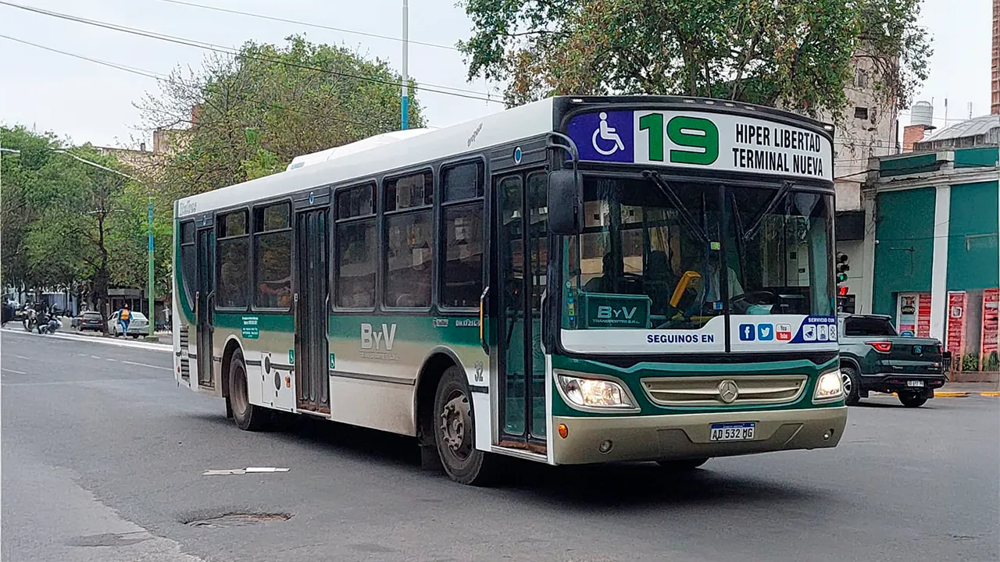

## Linea 19 - Horario

<p align="center"></p>

### Recorrido

```geojson
{"type":"FeatureCollection","features":[{"type":"Feature","properties":{"name":"Linea 19 - Horario"},"geometry":{"coordinates":[[-65.24432820418987,-26.79317260289069],[-65.24427212944921,-26.792904235996783],[-65.24371733799849,-26.792999218568347],[-65.24323561629346,-26.792713788617995],[-65.24274312791681,-26.79241970887827],[-65.24270449968431,-26.792097078320165],[-65.24262065142848,-26.791128597578478],[-65.2421179546776,-26.791215139686635],[-65.24152912454866,-26.791317059288417],[-65.24145835309001,-26.79078514636369],[-65.24137250829024,-26.790251311249445],[-65.2412931234943,-26.78976168674452],[-65.24119651202209,-26.789136545821982],[-65.24107583706977,-26.78838250514429],[-65.24104995294448,-26.78820155301488],[-65.24091101876084,-26.78773034340026],[-65.24058202795383,-26.786836606891775],[-65.24038439054816,-26.786275420752848],[-65.239748771213,-26.78639942889071],[-65.23894519179123,-26.78655611566538],[-65.23821187911409,-26.78669873273684],[-65.23751145593582,-26.786820981181652],[-65.23678519274398,-26.786946113018526],[-65.23592894559941,-26.787096516755167],[-65.23456127799463,-26.787332374714435],[-65.23362765739631,-26.787487787591058],[-65.23276509683485,-26.787628783688337],[-65.23149996348558,-26.787884988310836],[-65.2304291932502,-26.78807940795803],[-65.2293401196718,-26.788278633324758],[-65.22800978962935,-26.78852729572618],[-65.22686335435922,-26.78873812722899],[-65.2260743726063,-26.788882641957002],[-65.2248639912351,-26.789108561585437],[-65.22365744125797,-26.789329435002006],[-65.22252292704817,-26.789538911638033],[-65.22242728767132,-26.78956842499717],[-65.22237085464559,-26.789623548132177],[-65.2221992182255,-26.789675787948184],[-65.22157322542783,-26.78982261433245],[-65.22085248591391,-26.789989623877602],[-65.2194595463251,-26.79028258884963],[-65.21816203964606,-26.79057524884176],[-65.21661872345827,-26.79093040058052],[-65.21536590410408,-26.791200651047046],[-65.21432471584454,-26.79141030636123],[-65.21263733492341,-26.79174426159188],[-65.21049125936369,-26.792174746269964],[-65.20934435035304,-26.7923945934313],[-65.20826532301308,-26.792607311961298],[-65.20700427577447,-26.79286324826512],[-65.20636776259545,-26.79299121647223],[-65.20575321113482,-26.79311027392907],[-65.20225162583658,-26.793822308983405],[-65.20029545572224,-26.794205706680945],[-65.19779624971788,-26.7946747354919],[-65.19543590569378,-26.79512532942487],[-65.19315346637411,-26.79556836343194],[-65.19085066407001,-26.795998980247127],[-65.1887579513628,-26.796421560151597],[-65.18864545593469,-26.796510588185445],[-65.18862020627765,-26.79656500433381],[-65.18858133973563,-26.7966833549218],[-65.18868566283247,-26.797172511397367],[-65.1889838429726,-26.798401559691772],[-65.18922561953966,-26.79941705223754],[-65.18944468359574,-26.80034746386544],[-65.18960787405535,-26.801005658413136],[-65.18993425497465,-26.802409324520173],[-65.19009608589965,-26.803084338906146],[-65.19026722908951,-26.80374688652425],[-65.1905676102714,-26.80494315083219],[-65.19089178060861,-26.806300876304586],[-65.19122759127892,-26.807668991372086],[-65.1913086599949,-26.807998267239064],[-65.19151078817498,-26.808878173357535],[-65.19180329733862,-26.81008112176675],[-65.19199733350463,-26.810897739972795],[-65.19233539717823,-26.81235293052338],[-65.19279470892359,-26.814301302710252],[-65.19299503756436,-26.815148643423477],[-65.1933838920635,-26.816782565285322],[-65.19364994993502,-26.817949143113427],[-65.19392427659065,-26.8191261135401],[-65.19426694386873,-26.82053652083092],[-65.19476846571456,-26.822532926185893],[-65.19504539019736,-26.823693824117996],[-65.19534588041392,-26.824926225183425],[-65.19569018049957,-26.826322818404996],[-65.19603683715924,-26.827717308645237],[-65.19641670632157,-26.829309557335797],[-65.196768296605,-26.830897600226713],[-65.19695149043407,-26.831687869209894],[-65.19713939741119,-26.832482344112407],[-65.19595302118937,-26.832722507489976],[-65.19468416490385,-26.832977390611404],[-65.19488412911674,-26.833842524400023],[-65.19504130924734,-26.834528909845623],[-65.19521262881649,-26.835196370072303],[-65.19555055480856,-26.836548112978875],[-65.19576364519992,-26.837400413759852],[-65.19608122409937,-26.838794649290257],[-65.19641058586434,-26.84015102568593],[-65.19674881543732,-26.841564300690926],[-65.19709327806419,-26.842945387680487],[-65.19741827655004,-26.84431620158903],[-65.19773398293917,-26.845709124166607],[-65.19891260603991,-26.845367041550794],[-65.19958277767645,-26.845178927049147],[-65.19991566418287,-26.845088152404536],[-65.19999930173113,-26.845045616203002],[-65.20003047691019,-26.84500509552575],[-65.20004854504812,-26.844919545082398],[-65.20005172989471,-26.844842847538178],[-65.20006356565075,-26.84474494820148],[-65.20010640826315,-26.84467803404905],[-65.2001591730701,-26.844622186044994],[-65.20024227288168,-26.844590739185275],[-65.20033777543627,-26.844583637868396],[-65.20046924737953,-26.844626979244257],[-65.20053907833872,-26.844706152500407],[-65.20058410381208,-26.84481409773087],[-65.20064686872543,-26.844996789763655],[-65.20079569490032,-26.845553019215313],[-65.20101334744659,-26.846383341221333],[-65.20118783611859,-26.846977194179726],[-65.20139757732322,-26.847705845330857],[-65.20178684327554,-26.848947471586538],[-65.20220661014409,-26.850370616318507],[-65.20321998602786,-26.850145426424366],[-65.20333717392053,-26.850535020467184],[-65.20352822426221,-26.851165745042977],[-65.20365194349172,-26.85160882206589],[-65.20446452953603,-26.851412229470405],[-65.20564139174458,-26.851124277254034],[-65.20646913975457,-26.85092585559154],[-65.20781224620805,-26.850604621855496],[-65.20885097585175,-26.85036231490819],[-65.2099148858753,-26.85011701245417],[-65.21093468992228,-26.8498644114582],[-65.212444672033,-26.849512960998865],[-65.21307059020317,-26.849361645004493],[-65.21387373089519,-26.849167758898],[-65.21446666299,-26.84903540737002],[-65.21538395090863,-26.84881000470703],[-65.21503625860518,-26.847430443320636],[-65.21517461994334,-26.847402675179776],[-65.215520417408,-26.84733919039594],[-65.2161792592651,-26.847208973823083],[-65.21688376402997,-26.847077596575552],[-65.21770472416341,-26.846910502530292],[-65.2182982324034,-26.84678724266788],[-65.21892813294714,-26.846667229788235],[-65.22011482687475,-26.846466849946736],[-65.22107588852391,-26.846294069535713],[-65.22227903555392,-26.846063677420013],[-65.22262472623645,-26.845996491505993],[-65.22271486239157,-26.845922180183887],[-65.22280728783149,-26.84589825150921],[-65.22305203430362,-26.84583970609551],[-65.2240726015022,-26.84564067338606],[-65.22548984696172,-26.84534786553519],[-65.22662757965666,-26.84510671694043],[-65.22807788673285,-26.84483146891713],[-65.22958010332353,-26.844547313904986],[-65.23101574193194,-26.844274776887858],[-65.23260157323448,-26.843973663854932],[-65.23399773516147,-26.843708178075655],[-65.23574864843444,-26.843387860347697],[-65.23669853006619,-26.84321588533205],[-65.23683549538202,-26.843209015238383],[-65.23703634932855,-26.84352635719153],[-65.23809558133824,-26.84332800445147],[-65.23911687947253,-26.843117182046356],[-65.24011681316414,-26.842914900170765],[-65.24085320624825,-26.842755371660807],[-65.24218383340799,-26.84248138672418],[-65.24358234223926,-26.842202057419364],[-65.24486599793053,-26.84192842278876],[-65.245495589333,-26.84181218442025],[-65.24605330602395,-26.841685257603693],[-65.2470536985607,-26.84150837288176],[-65.24804256104305,-26.841417345751907],[-65.25022572005426,-26.841305507001064],[-65.25157672016591,-26.841216679495595],[-65.2525886848544,-26.8411397616996],[-65.25217948880376,-26.839814873434705],[-65.2519393297316,-26.838974660567608],[-65.25164896711348,-26.8379384332111],[-65.2513699254501,-26.83688705354309],[-65.2512336124527,-26.836390436966635],[-65.25016893142065,-26.836589770350752],[-65.24898349198317,-26.83681128806118],[-65.24763096464731,-26.837045235776838],[-65.24687752620353,-26.837176525795982],[-65.24675455557467,-26.836140094943715],[-65.24671384025172,-26.835798491430126],[-65.24667880144673,-26.835567477382796],[-65.2466463299456,-26.83538628776453],[-65.24659453254068,-26.835269223700134],[-65.24744295082644,-26.835115227878575],[-65.2489760060653,-26.83483763001341],[-65.25047904916755,-26.834575536012608],[-65.25174759066506,-26.834355796573107],[-65.25303783624666,-26.834123777415144],[-65.25409746225819,-26.833946728259978],[-65.25438110184416,-26.83391936047508],[-65.25432986917617,-26.833641102526627],[-65.25418633460156,-26.83309868094564],[-65.25392453883157,-26.832120958691817],[-65.25347676742359,-26.830351568808105],[-65.25306070590656,-26.828852025962842],[-65.25271144770635,-26.827548895881314],[-65.25234508594384,-26.826249581560134],[-65.25209776945493,-26.82528911361517],[-65.25161955487313,-26.82371430939308],[-65.25138836850466,-26.822862238534437],[-65.25114236065684,-26.82194777695469],[-65.25095094248294,-26.82128067396731],[-65.2508787507947,-26.821017716719332],[-65.25078090376259,-26.82045711972837],[-65.25036923540473,-26.81862753570281],[-65.2500689241941,-26.81724402293489],[-65.24987466410641,-26.816318205187294],[-65.24965958386835,-26.815413446248265],[-65.24943405790172,-26.814454405225334],[-65.249209919945,-26.813456962948873],[-65.24908787589081,-26.81330814813272],[-65.24897634016327,-26.812845416188132],[-65.24874051477724,-26.811785893810338],[-65.24858496528259,-26.81104376290166],[-65.24852001820719,-26.81086732489557],[-65.24846116032859,-26.810777252943936],[-65.24842513989758,-26.81069088688947],[-65.24827346760425,-26.81011544990565],[-65.2481046917495,-26.809394995040886],[-65.24779279538213,-26.808051397529265],[-65.24744366023376,-26.806901000737625],[-65.24723990536602,-26.80623910090975],[-65.24705940561796,-26.805616273389724],[-65.24689624621985,-26.804980099345528],[-65.24681860463396,-26.80461870823972],[-65.24662639030905,-26.803787262290875],[-65.24652824557792,-26.80336227035251],[-65.24628437812974,-26.802225182079695],[-65.2460533383543,-26.80112244252273],[-65.2458593888178,-26.800285651878536],[-65.24568254284445,-26.799464127591012],[-65.24531602322324,-26.79778673002208],[-65.24500430211715,-26.79636884850706],[-65.24470968457338,-26.794950967182967],[-65.24452684075248,-26.794118793917146],[-65.24434441461061,-26.79322493227932]],"type":"LineString"}}]}
```

### Paradas

```geojson
{"type":"FeatureCollection","properties":{"name":"Linea 19 - Horario"},"features":[{"type":"Feature","geometry":{"type":"Point","coordinates":[-65.24432820418987,-26.79317260289069]},"properties":{"name":"Inicio del recorrido"}},{"type":"Feature","geometry":{"type":"Point","coordinates":[-65.24281203461939,-26.792449502418968]},"properties":{"name":"Ing Antonio Correa y Emilio castelar"}},{"type":"Feature","geometry":{"type":"Point","coordinates":[-65.2426012714187,-26.791172807849584]},"properties":{"name":"Lisandro Borda y Emilio Castelar"}},{"type":"Feature","geometry":{"type":"Point","coordinates":[-65.24110176530675,-26.789272062239597]},"properties":{"name":"Castro Barros y Emilio Castelar"}},{"type":"Feature","geometry":{"type":"Point","coordinates":[-65.24092932210388,-26.787632308932988]},"properties":{"name":"Castro Barros y Pje. Madrid"}},{"type":"Feature","geometry":{"type":"Point","coordinates":[-65.24033701718966,-26.78630041023798]},"properties":{"name":"Castro Barros y Av. Fco. de Aguirre"}},{"type":"Feature","geometry":{"type":"Point","coordinates":[-65.23893227178445,-26.786636850703896]},"properties":{"name":"Av. Fco. de Aguirre y Pje Federico Helguera"}},{"type":"Feature","geometry":{"type":"Point","coordinates":[-65.23737089971392,-26.786947074145804]},"properties":{"name":"Av. Fco. de Aguirre y Bulnes"}},{"type":"Feature","geometry":{"type":"Point","coordinates":[-65.23585357889297,-26.787183018167678]},"properties":{"name":"Av. Fco. de Aguirre y Pje Padre Roque"}},{"type":"Feature","geometry":{"type":"Point","coordinates":[-65.23276509683485,-26.787685489912942]},"properties":{"name":"Av. Fco. de Aguirre y Estado de Israel"}},{"type":"Feature","geometry":{"type":"Point","coordinates":[-65.22929382298175,-26.78834495039071]},"properties":{"name":"Av. Fco. de Aguirre y Necochea"}},{"type":"Feature","geometry":{"type":"Point","coordinates":[-65.22606791260334,-26.788914358651198]},"properties":{"name":"Av. Fco. de Aguirre y Diag. Facundo Quiroga"}},{"type":"Feature","geometry":{"type":"Point","coordinates":[-65.22374835657922,-26.789371003397083]},"properties":{"name":"Av. Fco. de Aguirre y Saavedra"}},{"type":"Feature","geometry":{"type":"Point","coordinates":[-65.22097737931233,-26.78997328513124]},"properties":{"name":"(Ida)Av. Fco de Aguirre y J.J Paso"}},{"type":"Feature","geometry":{"type":"Point","coordinates":[-65.21954890970417,-26.790333527149368]},"properties":{"name":"(Vuelta) Av. F. de Aguirre y Thames"}},{"type":"Feature","geometry":{"type":"Point","coordinates":[-65.21829979950871,-26.79062515080258]},"properties":{"name":"(Vuelta) Av. F. de Aguirre y  Alberti"}},{"type":"Feature","geometry":{"type":"Point","coordinates":[-65.21510335854694,-26.791271294658365]},"properties":{"name":"(Vuelta) Av. F. de Aguirre y San Miguel"}},{"type":"Feature","geometry":{"type":"Point","coordinates":[-65.21270122355568,-26.791803074009565]},"properties":{"name":"(Vuelta) Av. F. de Aguirre y L. C�rdoba"}},{"type":"Feature","geometry":{"type":"Point","coordinates":[-65.21049125936369,-26.792174746269964]},"properties":{"name":"Av. Fco. de Aguirre y Rep. del Libano"}},{"type":"Feature","geometry":{"type":"Point","coordinates":[-65.20828129517173,-26.792660777388882]},"properties":{"name":"(Ida)Av. Fco de Aguirre y Suipacha"}},{"type":"Feature","geometry":{"type":"Point","coordinates":[-65.2058151032474,-26.79321542212215]},"properties":{"name":" Av. Fco de Aguirre y Diagonal"}},{"type":"Feature","geometry":{"type":"Point","coordinates":[-65.20233681178004,-26.793907294741384]},"properties":{"name":"Av. Fco. de Aguirre y Rep. de Siria"}},{"type":"Feature","geometry":{"type":"Point","coordinates":[-65.20042150948038,-26.794221780900838]},"properties":{"name":"Av. Fco. de Aguirre y Junin"}},{"type":"Feature","geometry":{"type":"Point","coordinates":[-65.19795531755601,-26.794650624258896]},"properties":{"name":"Av. Fco. de Aguirre y Mu�ecas"}},{"type":"Feature","geometry":{"type":"Point","coordinates":[-65.1963602999218,-26.794999415661408]},"properties":{"name":"Av. Fco. de Aguirre y 25 de Mayo"}},{"type":"Feature","geometry":{"type":"Point","coordinates":[-65.19318948173331,-26.795611227498625]},"properties":{"name":"Av. Fco. de Aguirre y Rivadavia"}},{"type":"Feature","geometry":{"type":"Point","coordinates":[-65.18877595904269,-26.796440313040936]},"properties":{"name":"Av. Fco. de Aguirre y J. B. Justo"}},{"type":"Feature","geometry":{"type":"Point","coordinates":[-65.18868760162732,-26.7970929045058]},"properties":{"name":"Av. Juan B. Justo y Marconi"}},{"type":"Feature","geometry":{"type":"Point","coordinates":[-65.18935599126767,-26.799394194126283]},"properties":{"name":"Av. Juan B. Justo y Emilio Castelar"}},{"type":"Feature","geometry":{"type":"Point","coordinates":[-65.19001806537109,-26.80226802348552]},"properties":{"name":"Av Juan B Justo y Delfin Gallo"}},{"type":"Feature","geometry":{"type":"Point","coordinates":[-65.19062581193515,-26.804928605469787]},"properties":{"name":"Av. Juan B. Justo y Mejico"}},{"type":"Feature","geometry":{"type":"Point","coordinates":[-65.1913300262078,-26.807675224948323]},"properties":{"name":" Av.Juan B.Justo y Colombia"}},{"type":"Feature","geometry":{"type":"Point","coordinates":[-65.19186059860498,-26.810404558336508]},"properties":{"name":" Av.Juan B.Justo y Paraguay"}},{"type":"Feature","geometry":{"type":"Point","coordinates":[-65.19293139017022,-26.81433915991818]},"properties":{"name":"Av Juan B Justo y Chile"}},{"type":"Feature","geometry":{"type":"Point","coordinates":[-65.19365489798459,-26.817171644125473]},"properties":{"name":"Av Juan B Justo e Italia"}},{"type":"Feature","geometry":{"type":"Point","coordinates":[-65.1939539478812,-26.818523290972077]},"properties":{"name":"Av Juan B Justo y Espa�a"}},{"type":"Feature","geometry":{"type":"Point","coordinates":[-65.19494756527958,-26.822440393008513]},"properties":{"name":"Av. Avellaneda y Marcos Paz"}},{"type":"Feature","geometry":{"type":"Point","coordinates":[-65.19536237642647,-26.824928328164752]},"properties":{"name":"Av. Avellaneda y Santiago"}},{"type":"Feature","geometry":{"type":"Point","coordinates":[-65.19610517778256,-26.82770889692694]},"properties":{"name":"Av. Avellaneda y Cordoba"}},{"type":"Feature","geometry":{"type":"Point","coordinates":[-65.19686727268036,-26.830868160035948]},"properties":{"name":"Av. Avellaneda y San Martin"}},{"type":"Feature","geometry":{"type":"Point","coordinates":[-65.19570844521488,-26.836548112978875]},"properties":{"name":"Av.Brigido Teran y Domingo Garcia"}},{"type":"Feature","geometry":{"type":"Point","coordinates":[-65.19611006146448,-26.838430756451814]},"properties":{"name":"Av. Brigido Teran y Jose Ingenieros"}},{"type":"Feature","geometry":{"type":"Point","coordinates":[-65.19698682933327,-26.842140431474633]},"properties":{"name":"Av. Brigido Teran y Prebish"}},{"type":"Feature","geometry":{"type":"Point","coordinates":[-65.19775913635874,-26.84560626252325]},"properties":{"name":"Av. Brigido Teran y Av. Pedro Miguel Araoz"}},{"type":"Feature","geometry":{"type":"Point","coordinates":[-65.20070562294536,-26.844995291982542]},"properties":{"name":"Plazoleta Dorrego"}},{"type":"Feature","geometry":{"type":"Point","coordinates":[-65.20090087508244,-26.846344399366757]},"properties":{"name":"Av. Marina Alfaro y Octavio Vera"}},{"type":"Feature","geometry":{"type":"Point","coordinates":[-65.20170458736763,-26.848884566929062]},"properties":{"name":"Av. Marina Alfaro y Florida"}},{"type":"Feature","geometry":{"type":"Point","coordinates":[-65.20219653799198,-26.850267274231136]},"properties":{"name":"Av. Marina Alfaro e Independencia"}},{"type":"Feature","geometry":{"type":"Point","coordinates":[-65.20365580485417,-26.85135445510022]},"properties":{"name":"Moreno y Larrea"}},{"type":"Feature","geometry":{"type":"Point","coordinates":[-65.20611646158113,-26.8509265805851]},"properties":{"name":"Larrea y Las Heras"}},{"type":"Feature","geometry":{"type":"Point","coordinates":[-65.20771656076424,-26.850562686032966]},"properties":{"name":"Larrea y Congreso"}},{"type":"Feature","geometry":{"type":"Point","coordinates":[-65.2098477381952,-26.850081067312445]},"properties":{"name":"Larrea 519 y 9 de Julio"}},{"type":"Feature","geometry":{"type":"Point","coordinates":[-65.21207659448845,-26.84948660812919]},"properties":{"name":"Larrea y Chacabuco"}},{"type":"Feature","geometry":{"type":"Point","coordinates":[-65.21505967681115,-26.848846882068496]},"properties":{"name":"Larrea - Esquina Jujuy"}},{"type":"Feature","geometry":{"type":"Point","coordinates":[-65.21627387925315,-26.847157022254127]},"properties":{"name":"Av Independencia 977 - La Rioja"}},{"type":"Feature","geometry":{"type":"Point","coordinates":[-65.21865155144461,-26.846659112318523]},"properties":{"name":"Av Independencia 1141 Pje Primera Junta"}},{"type":"Feature","geometry":{"type":"Point","coordinates":[-65.22106980979008,-26.84619741205761]},"properties":{"name":"Av Independencia 1232 - Bernab� Ar�oz"}},{"type":"Feature","geometry":{"type":"Point","coordinates":[-65.222223133001,-26.845931858113325]},"properties":{"name":"Av Independencia 1450 - Alem"}},{"type":"Feature","geometry":{"type":"Point","coordinates":[-65.22350159685361,-26.845660268207777]},"properties":{"name":"Av Independencia Y Miguelillo"}},{"type":"Feature","geometry":{"type":"Point","coordinates":[-65.22655570494588,-26.84502655589423]},"properties":{"name":"Av. Independencia y Prospero Mena"}},{"type":"Feature","geometry":{"type":"Point","coordinates":[-65.22954216944811,-26.84443508786762]},"properties":{"name":"Av. Independencia y Frias Silva"}},{"type":"Feature","geometry":{"type":"Point","coordinates":[-65.23103371060945,-26.844178582915845]},"properties":{"name":"Av independencia y Pellegrini"}},{"type":"Feature","geometry":{"type":"Point","coordinates":[-65.23370225023824,-26.843656518101124]},"properties":{"name":"Av. Independencia y Amador Lucero"}},{"type":"Feature","geometry":{"type":"Point","coordinates":[-65.23592434217251,-26.843309479464487]},"properties":{"name":"Av independencia y Chiclana"}},{"type":"Feature","geometry":{"type":"Point","coordinates":[-65.238731551161,-26.84313143314236]},"properties":{"name":"Av Independencia 2365 intersecci�n G�emes"}},{"type":"Feature","geometry":{"type":"Point","coordinates":[-65.24095702527474,-26.842678771740488]},"properties":{"name":"Av. Independencia y Constitucion"}},{"type":"Feature","geometry":{"type":"Point","coordinates":[-65.24526930414257,-26.84176137241527]},"properties":{"name":"Av Independencia 2803 Juan B Teran"}},{"type":"Feature","geometry":{"type":"Point","coordinates":[-65.24743389902518,-26.841417345751907]},"properties":{"name":"Av Independencia 2977 ? Pie Esperanza"}},{"type":"Feature","geometry":{"type":"Point","coordinates":[-65.25068755570825,-26.841203083003432]},"properties":{"name":"Diego de Rojas 1300 e Independencia"}},{"type":"Feature","geometry":{"type":"Point","coordinates":[-65.25124561532644,-26.836739686516385]},"properties":{"name":"L�doro Quinteros y Alsina"}},{"type":"Feature","geometry":{"type":"Point","coordinates":[-65.24929071557303,-26.836797026734867]},"properties":{"name":"Alsina y Diego de Rojas"}},{"type":"Feature","geometry":{"type":"Point","coordinates":[-65.24718699992144,-26.837156156916596]},"properties":{"name":"Alsina y Lincoln"}},{"type":"Feature","geometry":{"type":"Point","coordinates":[-65.24668643735481,-26.83602444029883]},"properties":{"name":"Lincoln 930 - Kirchner"}},{"type":"Feature","geometry":{"type":"Point","coordinates":[-65.24826591518324,-26.83486856871923]},"properties":{"name":"Av Kirchner 3137 - Diego de Rojas"}},{"type":"Feature","geometry":{"type":"Point","coordinates":[-65.25195925520183,-26.834252903846043]},"properties":{"name":"Av Kirchner 3411 Esquina Gorriti"}},{"type":"Feature","geometry":{"type":"Point","coordinates":[-65.25349814687624,-26.830700693608065]},"properties":{"name":"Av Adofo de la Vega y Lavalle"}},{"type":"Feature","geometry":{"type":"Point","coordinates":[-65.25293670507855,-26.82885965721822]},"properties":{"name":"Av Adolfo de La Vega 542 y Pje B Sur Mer"}},{"type":"Feature","geometry":{"type":"Point","coordinates":[-65.25224674045967,-26.826261028705787]},"properties":{"name":"Av Adolfo de La Vega 356 Las Piedras"}},{"type":"Feature","geometry":{"type":"Point","coordinates":[-65.25146207481471,-26.823496336419144]},"properties":{"name":"Av Adolfo de La Vega 298 - San Lorenzo"}},{"type":"Feature","geometry":{"type":"Point","coordinates":[-65.25067402699024,-26.820520293133743]},"properties":{"name":"Av America 37 - Pje Nu�ez del Prado"}},{"type":"Feature","geometry":{"type":"Point","coordinates":[-65.25025125455223,-26.81866098098856]},"properties":{"name":"Av America 177- Mendoza"}},{"type":"Feature","geometry":{"type":"Point","coordinates":[-65.24992318314034,-26.817272513713082]},"properties":{"name":"Av America 295 - esquina Don Bosco"}},{"type":"Feature","geometry":{"type":"Point","coordinates":[-65.24954437903574,-26.81544936998256]},"properties":{"name":"Av Am�rica 433 - Pasaje Jos� Carman"}},{"type":"Feature","geometry":{"type":"Point","coordinates":[-65.24888485403244,-26.812922878954822]},"properties":{"name":"Av America 600 esq Pje Dr Vallejo"}},{"type":"Feature","geometry":{"type":"Point","coordinates":[-65.24832679441424,-26.810501982874126]},"properties":{"name":"Av Am�rica 637 - pasaje Houssay"}},{"type":"Feature","geometry":{"type":"Point","coordinates":[-65.24775858825755,-26.808337621788315]},"properties":{"name":"Av Am�rica 1030 - Espa�a"}},{"type":"Feature","geometry":{"type":"Point","coordinates":[-65.24719714645988,-26.806487165951282]},"properties":{"name":"Av Am�rica 1135 - Pje Zuvir�a"}},{"type":"Feature","geometry":{"type":"Point","coordinates":[-65.24701450876664,-26.80588342178742]},"properties":{"name":"Av Am�rica y Uruguay"}},{"type":"Feature","geometry":{"type":"Point","coordinates":[-65.24672025914978,-26.80463969867864]},"properties":{"name":"Av America Esquina Chile"}},{"type":"Feature","geometry":{"type":"Point","coordinates":[-65.24645983132794,-26.80337181156637]},"properties":{"name":"Av America 1415 - Bolivia"}},{"type":"Feature","geometry":{"type":"Point","coordinates":[-65.24595926876131,-26.801152975012155]},"properties":{"name":"Av America 1535 - pje Pedro de Valdivia"}},{"type":"Feature","geometry":{"type":"Point","coordinates":[-65.24522195362941,-26.797801996714764]},"properties":{"name":"Av America esquina Pje Holmberg"}},{"type":"Feature","geometry":{"type":"Point","coordinates":[-65.24466051183173,-26.794949058799336]},"properties":{"name":"Av America esquina M�jico"}}]}
```

### Editar en [`geojson.io`](https://geojson.io/#map=11/-26.8139/-65.2008)

- [recorrido.v2.geojson](https://geojson.io/#data=data:text/x-url,https%3A%2F%2Fraw.githubusercontent.com%2FFrancoJavierGadea%2FTucuman-colectivos%2Frefs%2Fheads%2Fmain%2Fdata%2Furbano%2F19%2Fhorario%2Frecorrido.v2.geojson)

- [recorrido.geojson](https://geojson.io/#data=data:text/x-url,https%3A%2F%2Fraw.githubusercontent.com%2FFrancoJavierGadea%2FTucuman-colectivos%2Frefs%2Fheads%2Fmain%2Fdata%2Furbano%2F19%2Fhorario%2Frecorrido.geojson)

- [paradas.geojson](https://geojson.io/#data=data:text/x-url,https%3A%2F%2Fraw.githubusercontent.com%2FFrancoJavierGadea%2FTucuman-colectivos%2Frefs%2Fheads%2Fmain%2Fdata%2Furbano%2F19%2Fhorario%2Fparadas.geojson)