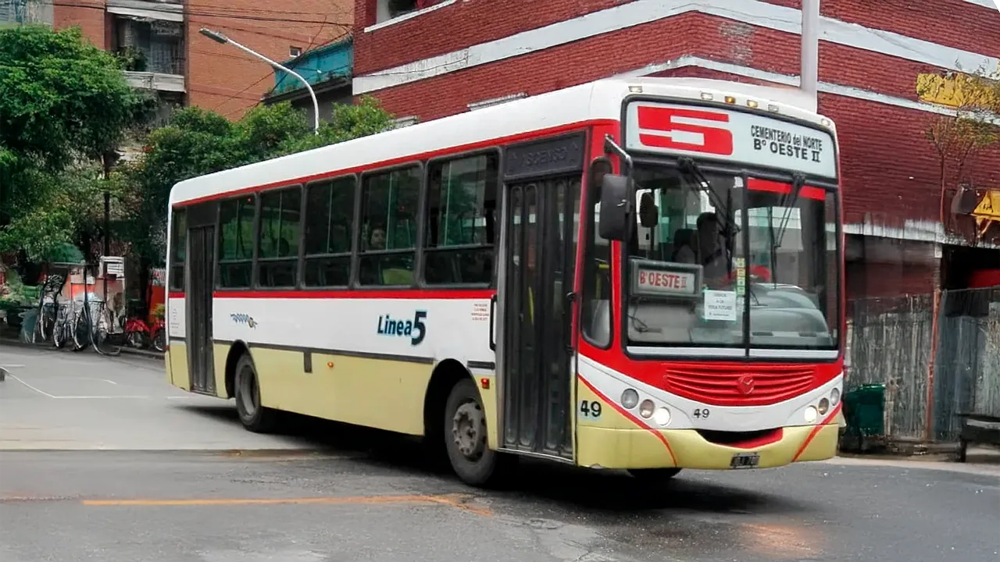

## Linea 5 - Balcarce

<p align="center"></p>

### Recorrido

```geojson
{"type":"FeatureCollection","features":[{"type":"Feature","properties":{"name":"Linea 5","direction":"Balcarce"},"geometry":{"coordinates":[[-65.25369393909881,-26.8137029548742],[-65.25239701011786,-26.813947545806233],[-65.25229112037837,-26.813985087399956],[-65.25215360211604,-26.81406247984821],[-65.25204973171986,-26.814102693573854],[-65.25136012106326,-26.814262822692374],[-65.25090328624015,-26.81437579165423],[-65.25046407853675,-26.8144842660395],[-65.24948014568402,-26.814679065635957],[-65.24946534358986,-26.81462697300556],[-65.24844734650462,-26.814833393754736],[-65.2464466399831,-26.81523676548748],[-65.24593177795529,-26.81534068718502],[-65.24534721426441,-26.815448558599353],[-65.24453983100143,-26.815596253840276],[-65.24304719800224,-26.815930081665282],[-65.24215208662133,-26.8161588655382],[-65.240977791972,-26.816406982161055],[-65.24127586600845,-26.817703927716064],[-65.24151231294492,-26.8186543110285],[-65.23999326257666,-26.818910936488212],[-65.23857747273625,-26.819163114082798],[-65.23714490158152,-26.81943533078459],[-65.23571827737173,-26.81970995611676],[-65.23425003878009,-26.819996808694906],[-65.23276469629954,-26.82028794337246],[-65.23138541833276,-26.82058265904989],[-65.23128725615648,-26.82067105265789],[-65.23134722985799,-26.820983596723877],[-65.23121137177881,-26.821010855400647],[-65.2299260017664,-26.82129296441779],[-65.2284726759815,-26.82158583133545],[-65.2269117410867,-26.82191867127957],[-65.2260404447222,-26.82209205135041],[-65.22534944014029,-26.82219724304226],[-65.22515845786786,-26.822230110722657],[-65.22454739669088,-26.822369213107198],[-65.22366000000001,-26.822560000000003],[-65.2234667169188,-26.82260429506986],[-65.22204531444055,-26.822923495330773],[-65.22132431108554,-26.82308931848492],[-65.22049563609048,-26.82327835359278],[-65.21902272550457,-26.823606578312504],[-65.2194000049235,-26.82506792449374],[-65.21973119415682,-26.82635020609986],[-65.21982821479173,-26.826469926644734],[-65.22000077587224,-26.827089259856116],[-65.2202007992778,-26.827811087063612],[-65.21941938652571,-26.828004007120363],[-65.21872830752852,-26.828170440407597],[-65.21838921071557,-26.82826189587176],[-65.21710435818218,-26.828552348005893],[-65.21562746174702,-26.82887186375922],[-65.21531181469072,-26.827664858115384],[-65.21528899664571,-26.82761769895533],[-65.2152153672641,-26.827578096865707],[-65.21362782953118,-26.827876187057505],[-65.21324726220789,-26.826385083815453],[-65.21291778855482,-26.82502881700767],[-65.21132026690202,-26.82537159206334],[-65.20993616878624,-26.825655000000005],[-65.20827260416915,-26.82601667975781],[-65.20677773186824,-26.826342549387164],[-65.20639193504819,-26.826433562061915],[-65.20591984582136,-26.82653470702874],[-65.20515083413818,-26.826680000000003],[-65.20374673889327,-26.82698053460926],[-65.20228419879521,-26.827256302265553],[-65.2008651982177,-26.827485066099285],[-65.20053040916271,-26.826162567372304],[-65.20020323370535,-26.824807856338648],[-65.19998350260396,-26.824072147548968],[-65.19980129816335,-26.8234567300634],[-65.19946637075678,-26.822066898952738],[-65.19930062411824,-26.821382730483847],[-65.19914079398568,-26.820652438282174],[-65.19882000000001,-26.819263684479736],[-65.2002575312271,-26.81899694087517],[-65.20180243174075,-26.81871161195375],[-65.20178965113432,-26.818621205380555],[-65.20149412159753,-26.817271785639807],[-65.20115393714998,-26.815905981595183],[-65.20109743218126,-26.815798518151787],[-65.20102897400236,-26.81551274906178],[-65.2008174328142,-26.814605636318266],[-65.20051049926676,-26.813240669000496],[-65.20020393455187,-26.811882628893066],[-65.19989271659459,-26.81053143354249],[-65.19972245654272,-26.809792992281384],[-65.19958913556603,-26.809224241629796],[-65.19938302189871,-26.808333129821214],[-65.1990905807178,-26.807201414856888],[-65.19888336343476,-26.806359855620247],[-65.19857398075018,-26.805040927568058],[-65.19825840454291,-26.803700000000003],[-65.1974875334199,-26.803846902301697],[-65.19674543254247,-26.80399119886364],[-65.19600204951746,-26.80413666749783],[-65.19519199108467,-26.804292253009343],[-65.19369644672805,-26.80454839254138],[-65.19218467252244,-26.804806907581007],[-65.19060186648669,-26.805108051402023],[-65.19046529902414,-26.804525607977496],[-65.19026695060705,-26.803746338956213],[-65.19186797453781,-26.80343531655177],[-65.19171018383645,-26.802769596910334],[-65.19154172506958,-26.802097926061712],[-65.19135750896825,-26.801405431641637],[-65.19119020630635,-26.800726781630093],[-65.19102901053061,-26.80005404781743],[-65.19077621534892,-26.79891791502221],[-65.19063479156937,-26.798286211337988],[-65.19045390173885,-26.79758267622322],[-65.1902791393967,-26.796878175369738],[-65.19009300400123,-26.796148370313524],[-65.19069313535809,-26.796030815952207],[-65.19174541426467,-26.7958236833885],[-65.19314403848182,-26.795571540220376],[-65.19471459653299,-26.79526890710542],[-65.19621888089473,-26.79497621007815],[-65.1977980832035,-26.79467577774691],[-65.19933393343673,-26.794387505475402],[-65.20029317097227,-26.794205060532786],[-65.20062781057216,-26.795576598995662],[-65.20090896042615,-26.79675969392766],[-65.19993335539458,-26.796938092072107],[-65.19836847892081,-26.79719685587122],[-65.19857715380074,-26.798109700213367],[-65.19874239297258,-26.798852098155965],[-65.19904190911326,-26.800229420647483],[-65.19914174231961,-26.800630993404123],[-65.19928206152014,-26.801308222738605],[-65.19943854910211,-26.80203822309701],[-65.19959070838567,-26.80273186664631],[-65.1997511557643,-26.80341912756108],[-65.20008447600934,-26.80474758627012],[-65.20033668988994,-26.80584536557914],[-65.20062060977789,-26.806988837660224],[-65.20093139356486,-26.808284304324875],[-65.20108617948318,-26.808958057283743],[-65.20120648588178,-26.809508202149807],[-65.20138005523954,-26.810242366792288],[-65.20170246319648,-26.811579418980198],[-65.20201262942003,-26.81295233258934],[-65.20232588615552,-26.814330990888273],[-65.20255642381208,-26.815213235332013],[-65.20267652091073,-26.815689438750358],[-65.20294496343043,-26.81688424867183],[-65.20327984181452,-26.8183944308956],[-65.20344797650262,-26.819124082396595],[-65.20357277799172,-26.81978603670357],[-65.20376567215808,-26.821216726126348],[-65.20379525090637,-26.8213801282027],[-65.20405762847875,-26.822566369584674],[-65.20439885411854,-26.823916706441164],[-65.20475815927834,-26.8252972812326],[-65.20639337698216,-26.82493023185254],[-65.2079022305748,-26.824577831625156],[-65.20953450007677,-26.824203370507668],[-65.21096203369916,-26.823891140447536],[-65.21130934240449,-26.82523504033095],[-65.21147169654448,-26.82547988734471],[-65.21157897010376,-26.82592886925107],[-65.21177654773534,-26.826692591001066],[-65.2121180052135,-26.828170483599195],[-65.21245700838044,-26.829512176523053],[-65.2139926146797,-26.829221726949957],[-65.21556267355626,-26.82892203412795],[-65.21566579299196,-26.828937938306225],[-65.21712376455697,-26.828632575192053],[-65.2183798171278,-26.828359080392666],[-65.2186703929291,-26.82828695352093],[-65.21847069787272,-26.82745541552864],[-65.21828764871383,-26.826738451312306],[-65.21791384777593,-26.825367363186896],[-65.21754221976607,-26.823937489650056],[-65.21717253528563,-26.822577292632456],[-65.21864495943676,-26.822225301272134],[-65.2201315684331,-26.821867738043554],[-65.22165918951131,-26.821510651613718],[-65.2230619355703,-26.82121870951474],[-65.22322946375682,-26.821182818727486],[-65.22483436977173,-26.820992069535396],[-65.22569631370992,-26.820831020997225],[-65.22657452837552,-26.82066653247214],[-65.22816658493663,-26.82035658291305],[-65.22810328473352,-26.820096256340385],[-65.2295798073528,-26.819795052155047],[-65.23104257511743,-26.819528056102595],[-65.23126625911515,-26.820673652998156],[-65.23151856280676,-26.82189436997086],[-65.233097897961,-26.821589163939095],[-65.23457515443104,-26.821273201100038],[-65.23603722826125,-26.820987722834293],[-65.23747593668872,-26.820710767578568],[-65.23892894506368,-26.82044860359638],[-65.24036581199358,-26.820201988827108],[-65.24182080971924,-26.819929037401806],[-65.24323608820872,-26.819638100798002],[-65.24440041417488,-26.819408126925683],[-65.2464928059742,-26.819025914824625],[-65.24885945266537,-26.818598648886827],[-65.25030347446204,-26.818331926893514],[-65.2512588485794,-26.8181466230252],[-65.25221672015478,-26.81796446506532],[-65.25191708321728,-26.816702544012717],[-65.25097332029947,-26.816878040407666],[-65.2500263718863,-26.8170497463658],[-65.24978087340152,-26.815917585299655],[-65.25072786474996,-26.815747640256944],[-65.25167869588562,-26.815593294891357],[-65.25260921763385,-26.815457456563884],[-65.25328052769484,-26.815380553816777],[-65.25404945621473,-26.815240367942124],[-65.25541592005223,-26.81501918972334],[-65.25613849761532,-26.814884732918202],[-65.25721779271879,-26.81467640906421],[-65.25829326024045,-26.81446809529554],[-65.25844445794284,-26.815110205764604],[-65.25861550201122,-26.815805834232084],[-65.25890269671456,-26.817059572694212],[-65.26023522769152,-26.816827827672217],[-65.26157725802263,-26.816567114737527],[-65.2629481274494,-26.816305042107356],[-65.26361369015761,-26.81618925077558],[-65.26412864390618,-26.81609343964009],[-65.26441580295844,-26.816046660447252],[-65.26435936196252,-26.81571218797535],[-65.26425084291245,-26.814980945129047],[-65.26416984124519,-26.814220536993112],[-65.26410070907853,-26.813546987747127],[-65.26404484430962,-26.8129568162691],[-65.26394101875093,-26.811957707320467],[-65.2638942938086,-26.811621344890632],[-65.26382035521426,-26.811277696050958],[-65.2636660479166,-26.810579412927108],[-65.26347783235971,-26.8100885871837],[-65.263259391922,-26.809678854622],[-65.26272064111537,-26.808775912954403],[-65.2624312368672,-26.808261564328973],[-65.26231160316043,-26.80798246520753],[-65.26215758921946,-26.807544775894694],[-65.26204840836435,-26.80713767134734],[-65.2619717316541,-26.806891719910098],[-65.26195654930066,-26.80677502859304],[-65.26190689825562,-26.80660811236672],[-65.26182620988718,-26.80642272823329],[-65.26155719022672,-26.805749225942062],[-65.26150856732338,-26.805713434073528],[-65.26116896368586,-26.804693606341253],[-65.26087955438116,-26.803796568535148],[-65.26065728713496,-26.80307823149606],[-65.26025644264632,-26.8016564258616],[-65.2600779093575,-26.80097487333943],[-65.25994636814283,-26.800543089414667],[-65.2596638677235,-26.799664041340513],[-65.25939882168137,-26.798897025429255],[-65.25876219561835,-26.797238345613234],[-65.25835144149647,-26.796138602842884],[-65.25738995340102,-26.79643815876511],[-65.25669563120238,-26.79664850713132],[-65.25631465984105,-26.795643195103676],[-65.2552316852351,-26.795983709239177],[-65.25558197407044,-26.796976332127873],[-65.25579477197167,-26.797540476802624],[-65.25598619084863,-26.79806636189073],[-65.25467131718132,-26.798466322911093],[-65.25486187157,-26.79897646071968],[-65.25504123596369,-26.799475500615365],[-65.25525378386645,-26.80002501544769],[-65.2539821225032,-26.800415019650348],[-65.25357701211067,-26.8005514000632],[-65.2526710237959,-26.801048302880663],[-65.25222992334973,-26.80129156929995],[-65.25129521039308,-26.801808861926084],[-65.2515579573504,-26.80263676086704],[-65.25173758726574,-26.803184476368802],[-65.25194229053226,-26.80353182645645],[-65.25319966640612,-26.802997732438662],[-65.2535752133365,-26.803660337002583],[-65.25358332039588,-26.803729634150947],[-65.25353273856068,-26.803926499669675],[-65.25426053602736,-26.80421883618798],[-65.25501940408533,-26.80453027713863],[-65.25595530989489,-26.80491968793442],[-65.25665852539267,-26.80519469593238],[-65.25733025865148,-26.80546039401353],[-65.25799328472912,-26.805758373949697],[-65.2577939652998,-26.80616068434875],[-65.25762528224774,-26.806521872831937],[-65.25761089178096,-26.80657338794414],[-65.25760715255805,-26.80661539645797],[-65.25766358157976,-26.80690974682082],[-65.25777601876142,-26.807395919614745],[-65.25677960191857,-26.8076036938745],[-65.25561909898131,-26.80785433446219],[-65.25567187357828,-26.807942328294118],[-65.25582466121703,-26.808639889916062],[-65.25594541372597,-26.809237432899753],[-65.25609007951444,-26.809888977308276],[-65.25623231155518,-26.81051880109335],[-65.25637900699043,-26.811163400189763],[-65.25652570242568,-26.811758923778438],[-65.25669099998133,-26.812416741776705],[-65.25683856713933,-26.813120334201148],[-65.25567090322706,-26.81333],[-65.25478148936318,-26.81350511162701],[-65.25373410220303,-26.813696810069008]],"type":"LineString"}}]}
```

### Paradas

```geojson
{"type":"FeatureCollection","properties":{"name":"Linea 5","direction":"Balcarce"},"features":[{"type":"Feature","geometry":{"type":"Point","coordinates":[-65.258354,-26.796068]},"properties":{"name":"Ecuador Y Camino Del Peru"}},{"type":"Feature","geometry":{"type":"Point","coordinates":[-65.259164,-26.797527]},"properties":{"name":"Camino Del Peru  1468"}},{"type":"Feature","geometry":{"type":"Point","coordinates":[-65.259975,-26.800048]},"properties":{"name":"Camino Del Peru  1250"}},{"type":"Feature","geometry":{"type":"Point","coordinates":[-65.261022,-26.803555]},"properties":{"name":"Camino Del Peru  950"}},{"type":"Feature","geometry":{"type":"Point","coordinates":[-65.262122,-26.807352]},"properties":{"name":"Camino del Perú 756"}},{"type":"Feature","geometry":{"type":"Point","coordinates":[-65.264146,-26.815953]},"properties":{"name":"Camino Del Peru y Mendoza"}},{"type":"Feature","geometry":{"type":"Point","coordinates":[-65.263203,-26.816297]},"properties":{"name":"Mendoza 4710"}},{"type":"Feature","geometry":{"type":"Point","coordinates":[-65.260514,-26.816797]},"properties":{"name":"Mendoza 4510"}},{"type":"Feature","geometry":{"type":"Point","coordinates":[-65.25907,-26.81703]},"properties":{"name":"Mendoza 4410"}},{"type":"Feature","geometry":{"type":"Point","coordinates":[-65.25872,-26.816193]},"properties":{"name":"L. Mansilla 269"}},{"type":"Feature","geometry":{"type":"Point","coordinates":[-65.258219,-26.814896]},"properties":{"name":"L. Mansilla 369"}},{"type":"Feature","geometry":{"type":"Point","coordinates":[-65.25568,-26.815114]},"properties":{"name":"San Juan 4110"}},{"type":"Feature","geometry":{"type":"Point","coordinates":[-65.25637,-26.815002]},"properties":{"name":"San juan 4210"}},{"type":"Feature","geometry":{"type":"Point","coordinates":[-65.255822,-26.8151]},"properties":{"name":"San juan 4150"}},{"type":"Feature","geometry":{"type":"Point","coordinates":[-65.255038,-26.815351]},"properties":{"name":"San juan 4050"}},{"type":"Feature","geometry":{"type":"Point","coordinates":[-65.25308,-26.815531]},"properties":{"name":"San juan 3920"}},{"type":"Feature","geometry":{"type":"Point","coordinates":[-65.251858,-26.815632]},"properties":{"name":"San juan 3820"}},{"type":"Feature","geometry":{"type":"Point","coordinates":[-65.249943,-26.815973]},"properties":{"name":"San juan 3620"}},{"type":"Feature","geometry":{"type":"Point","coordinates":[-65.249577,-26.816902]},"properties":{"name":"Avenida América 315"}},{"type":"Feature","geometry":{"type":"Point","coordinates":[-65.251113,-26.816929]},"properties":{"name":"Don Bosco 3680"}},{"type":"Feature","geometry":{"type":"Point","coordinates":[-65.250709,-26.818335]},"properties":{"name":"Mendoza 3610"}},{"type":"Feature","geometry":{"type":"Point","coordinates":[-65.252026,-26.817423]},"properties":{"name":"Esquiú 215"}},{"type":"Feature","geometry":{"type":"Point","coordinates":[-65.249085,-26.818466]},"properties":{"name":"Mendoza 3510"}},{"type":"Feature","geometry":{"type":"Point","coordinates":[-65.246884,-26.818966]},"properties":{"name":"Mendoza 3410"}},{"type":"Feature","geometry":{"type":"Point","coordinates":[-65.245515,-26.819238]},"properties":{"name":"Mendoza 3310"}},{"type":"Feature","geometry":{"type":"Point","coordinates":[-65.243545,-26.819571]},"properties":{"name":"Mendoza 3110"}},{"type":"Feature","geometry":{"type":"Point","coordinates":[-65.242008,-26.819897]},"properties":{"name":"Mendoza 3010"}},{"type":"Feature","geometry":{"type":"Point","coordinates":[-65.240687,-26.820181]},"properties":{"name":"Mendoza 2910"}},{"type":"Feature","geometry":{"type":"Point","coordinates":[-65.239127,-26.820455]},"properties":{"name":"Mendoza 2810"}},{"type":"Feature","geometry":{"type":"Point","coordinates":[-65.237726,-26.820697]},"properties":{"name":"Mendoza 2710"}},{"type":"Feature","geometry":{"type":"Point","coordinates":[-65.236312,-26.821035]},"properties":{"name":"Mendoza 2610"}},{"type":"Feature","geometry":{"type":"Point","coordinates":[-65.234819,-26.821207]},"properties":{"name":"Mendoza 2510"}},{"type":"Feature","geometry":{"type":"Point","coordinates":[-65.233314,-26.821572]},"properties":{"name":"Mendoza 2410"}},{"type":"Feature","geometry":{"type":"Point","coordinates":[-65.231898,-26.821848]},"properties":{"name":"Mendoza 2320"}},{"type":"Feature","geometry":{"type":"Point","coordinates":[-65.231305,-26.821112]},"properties":{"name":"Ejercito Del Norte 295"}},{"type":"Feature","geometry":{"type":"Point","coordinates":[-65.231143,-26.819825]},"properties":{"name":"Ejercito Del Norte 350"}},{"type":"Feature","geometry":{"type":"Point","coordinates":[-65.230286,-26.819814]},"properties":{"name":"San juan 2240"}},{"type":"Feature","geometry":{"type":"Point","coordinates":[-65.228739,-26.82012]},"properties":{"name":"San juan 2140"}},{"type":"Feature","geometry":{"type":"Point","coordinates":[-65.227317,-26.820788]},"properties":{"name":"San Juan 2040"}},{"type":"Feature","geometry":{"type":"Point","coordinates":[-65.225611,-26.820973]},"properties":{"name":"San Juan 1940"}},{"type":"Feature","geometry":{"type":"Point","coordinates":[-65.223844,-26.821355]},"properties":{"name":"San Juan 1840"}},{"type":"Feature","geometry":{"type":"Point","coordinates":[-65.222279,-26.821496]},"properties":{"name":"San Juan 1740"}},{"type":"Feature","geometry":{"type":"Point","coordinates":[-65.220887,-26.82193]},"properties":{"name":"San Juan 1640"}},{"type":"Feature","geometry":{"type":"Point","coordinates":[-65.219339,-26.822189]},"properties":{"name":"San Juan 1540"}},{"type":"Feature","geometry":{"type":"Point","coordinates":[-65.21732,-26.8233]},"properties":{"name":"San Juan 1440"}},{"type":"Feature","geometry":{"type":"Point","coordinates":[-65.21815,-26.82605]},"properties":{"name":"Avenida Mitre 150"}},{"type":"Feature","geometry":{"type":"Point","coordinates":[-65.217856,-26.828574]},"properties":{"name":"24 de Septiembre 1350"}},{"type":"Feature","geometry":{"type":"Point","coordinates":[-65.214345,-26.828978]},"properties":{"name":"24 de Septiembre 1125"}},{"type":"Feature","geometry":{"type":"Point","coordinates":[-65.212194,-26.828856]},"properties":{"name":"Catamarca 51"}},{"type":"Feature","geometry":{"type":"Point","coordinates":[-65.211532,-26.826126]},"properties":{"name":"Catamarca 241"}},{"type":"Feature","geometry":{"type":"Point","coordinates":[-65.209266,-26.824538]},"properties":{"name":"San juan 890"}},{"type":"Feature","geometry":{"type":"Point","coordinates":[-65.207339,-26.82482]},"properties":{"name":"San juan 758"}},{"type":"Feature","geometry":{"type":"Point","coordinates":[-65.204295,-26.824382]},"properties":{"name":"I. Muñecas  475"}},{"type":"Feature","geometry":{"type":"Point","coordinates":[-65.20379,-26.82163]},"properties":{"name":"I. Muñecas 675"}},{"type":"Feature","geometry":{"type":"Point","coordinates":[-65.203943,-26.819035]},"properties":{"name":"I. Muñecas 850"}},{"type":"Feature","geometry":{"type":"Point","coordinates":[-65.202866,-26.817524]},"properties":{"name":"I. Muñecas 969"}},{"type":"Feature","geometry":{"type":"Point","coordinates":[-65.202602,-26.816422]},"properties":{"name":"I. Muñecas 1069"}},{"type":"Feature","geometry":{"type":"Point","coordinates":[-65.2023,-26.81456]},"properties":{"name":"I. Muñecas 1181"}},{"type":"Feature","geometry":{"type":"Point","coordinates":[-65.201851,-26.813257]},"properties":{"name":"I. Muñecas 1285"}},{"type":"Feature","geometry":{"type":"Point","coordinates":[-65.20162,-26.81195]},"properties":{"name":"I. Muñecas 1379"}},{"type":"Feature","geometry":{"type":"Point","coordinates":[-65.201407,-26.810624]},"properties":{"name":"I. Muñecas 1477"}},{"type":"Feature","geometry":{"type":"Point","coordinates":[-65.200969,-26.808459]},"properties":{"name":"I. Muñecas 1600"}},{"type":"Feature","geometry":{"type":"Point","coordinates":[-65.20046,-26.807219]},"properties":{"name":"I. Muñecas 1691"}},{"type":"Feature","geometry":{"type":"Point","coordinates":[-65.200203,-26.806049]},"properties":{"name":"I. Muñecas 1791"}},{"type":"Feature","geometry":{"type":"Point","coordinates":[-65.200058,-26.80503]},"properties":{"name":"I. Muñecas 1891"}},{"type":"Feature","geometry":{"type":"Point","coordinates":[-65.199701,-26.803824]},"properties":{"name":"I. Muñecas 1991"}},{"type":"Feature","geometry":{"type":"Point","coordinates":[-65.199287,-26.802193]},"properties":{"name":"I. Muñecas 2091"}},{"type":"Feature","geometry":{"type":"Point","coordinates":[-65.199006,-26.800826]},"properties":{"name":"I. Muñecas 2191"}},{"type":"Feature","geometry":{"type":"Point","coordinates":[-65.198996,-26.799879]},"properties":{"name":"I. Muñecas 2291"}},{"type":"Feature","geometry":{"type":"Point","coordinates":[-65.198612,-26.799142]},"properties":{"name":"I. Muñecas 2391"}},{"type":"Feature","geometry":{"type":"Point","coordinates":[-65.199532,-26.796948]},"properties":{"name":"Emilio Castelar 669"}},{"type":"Feature","geometry":{"type":"Point","coordinates":[-65.200561,-26.796648]},"properties":{"name":"Emilio Castelar 769"}},{"type":"Feature","geometry":{"type":"Point","coordinates":[-65.200501,-26.796009]},"properties":{"name":"Junin 2569"}},{"type":"Feature","geometry":{"type":"Point","coordinates":[-65.200188,-26.794693]},"properties":{"name":"Junin 2669"}},{"type":"Feature","geometry":{"type":"Point","coordinates":[-65.200113,-26.794436]},"properties":{"name":"Avenida Fco de Agrirre 768"}},{"type":"Feature","geometry":{"type":"Point","coordinates":[-65.199618,-26.794538]},"properties":{"name":"Avenida Fco de Agrirre 668"}},{"type":"Feature","geometry":{"type":"Point","coordinates":[-65.197178,-26.795106]},"properties":{"name":"Avenida Fco de Agrirre 568"}},{"type":"Feature","geometry":{"type":"Point","coordinates":[-65.195351,-26.795439]},"properties":{"name":"Avenida Fco de Agrirre 468"}},{"type":"Feature","geometry":{"type":"Point","coordinates":[-65.194337,-26.795757]},"properties":{"name":"Avenida Fco de Agrirre 368"}},{"type":"Feature","geometry":{"type":"Point","coordinates":[-65.192605,-26.795857]},"properties":{"name":"Avenida Fco de Agrirre 268"}},{"type":"Feature","geometry":{"type":"Point","coordinates":[-65.191178,-26.796136]},"properties":{"name":"Avenida Fco de Agrirre 168"}},{"type":"Feature","geometry":{"type":"Point","coordinates":[-65.190357,-26.796987]},"properties":{"name":"Balcarce 2610"}},{"type":"Feature","geometry":{"type":"Point","coordinates":[-65.190522,-26.797805]},"properties":{"name":"Balcarce 2518"}},{"type":"Feature","geometry":{"type":"Point","coordinates":[-65.19144,-26.800868]},"properties":{"name":"Balcarce 2318"}},{"type":"Feature","geometry":{"type":"Point","coordinates":[-65.19173,-26.801957]},"properties":{"name":"Balcarce 2218"}},{"type":"Feature","geometry":{"type":"Point","coordinates":[-65.192125,-26.803355]},"properties":{"name":"Balcarce 2100"}},{"type":"Feature","geometry":{"type":"Point","coordinates":[-65.1922,-26.804822]},"properties":{"name":"Balcarce 2018"}},{"type":"Feature","geometry":{"type":"Point","coordinates":[-65.190844,-26.803772]},"properties":{"name":"Manuel Estrada 20"}},{"type":"Feature","geometry":{"type":"Point","coordinates":[-65.190652,-26.804701]},"properties":{"name":"Juan B. Justo 2020"}},{"type":"Feature","geometry":{"type":"Point","coordinates":[-65.191902,-26.804723]},"properties":{"name":"Mexico 91"}},{"type":"Feature","geometry":{"type":"Point","coordinates":[-65.193421,-26.804369]},"properties":{"name":"Mexico 191"}},{"type":"Feature","geometry":{"type":"Point","coordinates":[-65.19488,-26.804254]},"properties":{"name":"Mexico 291"}},{"type":"Feature","geometry":{"type":"Point","coordinates":[-65.196421,-26.804017]},"properties":{"name":"Mexico 391"}},{"type":"Feature","geometry":{"type":"Point","coordinates":[-65.198098,-26.803626]},"properties":{"name":"Mexico 491"}},{"type":"Feature","geometry":{"type":"Point","coordinates":[-65.198744,-26.804688]},"properties":{"name":"25 de Mayo 1920"}},{"type":"Feature","geometry":{"type":"Point","coordinates":[-65.198915,-26.805672]},"properties":{"name":"25 de Mayo 1820"}},{"type":"Feature","geometry":{"type":"Point","coordinates":[-65.199191,-26.806848]},"properties":{"name":"25 de Mayo 1720"}},{"type":"Feature","geometry":{"type":"Point","coordinates":[-65.199392,-26.808324]},"properties":{"name":"25 de Mayo 1650"}},{"type":"Feature","geometry":{"type":"Point","coordinates":[-65.199762,-26.808967]},"properties":{"name":"25 de Mayo 1610"}},{"type":"Feature","geometry":{"type":"Point","coordinates":[-65.199958,-26.810067]},"properties":{"name":"25 de Mayo 1520"}},{"type":"Feature","geometry":{"type":"Point","coordinates":[-65.200364,-26.811509]},"properties":{"name":"25 de Mayo 1420"}},{"type":"Feature","geometry":{"type":"Point","coordinates":[-65.200671,-26.812897]},"properties":{"name":"25 de Mayo 1320"}},{"type":"Feature","geometry":{"type":"Point","coordinates":[-65.200977,-26.814268]},"properties":{"name":"25 de Mayo 1220"}},{"type":"Feature","geometry":{"type":"Point","coordinates":[-65.201054,-26.815488]},"properties":{"name":"25 de Mayo 1120"}},{"type":"Feature","geometry":{"type":"Point","coordinates":[-65.201906,-26.817353]},"properties":{"name":"25 de Mayo 1020"}},{"type":"Feature","geometry":{"type":"Point","coordinates":[-65.201886,-26.818195]},"properties":{"name":"25 de Mayo 920"}},{"type":"Feature","geometry":{"type":"Point","coordinates":[-65.200977,-26.819068]},"properties":{"name":"Avenida Sarmiento 450"}},{"type":"Feature","geometry":{"type":"Point","coordinates":[-65.199365,-26.821065]},"properties":{"name":"Virgen De la Merced 776"}},{"type":"Feature","geometry":{"type":"Point","coordinates":[-65.200096,-26.823914]},"properties":{"name":"Virgen De la Merced 570"}},{"type":"Feature","geometry":{"type":"Point","coordinates":[-65.200737,-26.826783]},"properties":{"name":"Virgen De la Merced 354"}},{"type":"Feature","geometry":{"type":"Point","coordinates":[-65.203234,-26.826981]},"properties":{"name":"Cordoba 473"}},{"type":"Feature","geometry":{"type":"Point","coordinates":[-65.205998,-26.82637]},"properties":{"name":"Cordoba 649"}},{"type":"Feature","geometry":{"type":"Point","coordinates":[-65.20892,-26.825752]},"properties":{"name":"Cordoba 839"}},{"type":"Feature","geometry":{"type":"Point","coordinates":[-65.213359,-26.825823]},"properties":{"name":"Jose Colombres  238"}},{"type":"Feature","geometry":{"type":"Point","coordinates":[-65.213995,-26.827671]},"properties":{"name":"San Martin 1121"}},{"type":"Feature","geometry":{"type":"Point","coordinates":[-65.217503,-26.82833]},"properties":{"name":"24 de Septiembre 1321"}},{"type":"Feature","geometry":{"type":"Point","coordinates":[-65.220059,-26.827563]},"properties":{"name":"12 de Octubre 11"}},{"type":"Feature","geometry":{"type":"Point","coordinates":[-65.219755,-26.826609]},"properties":{"name":"12 de Octubre 97"}},{"type":"Feature","geometry":{"type":"Point","coordinates":[-65.219213,-26.825226]},"properties":{"name":"12 de Octubre 197"}},{"type":"Feature","geometry":{"type":"Point","coordinates":[-65.218876,-26.823867]},"properties":{"name":"12 de Octubre 297"}},{"type":"Feature","geometry":{"type":"Point","coordinates":[-65.220492,-26.82327]},"properties":{"name":"Don Bosco 1597"}},{"type":"Feature","geometry":{"type":"Point","coordinates":[-65.221873,-26.822739]},"properties":{"name":"Don Bosco 1697"}},{"type":"Feature","geometry":{"type":"Point","coordinates":[-65.223269,-26.822429]},"properties":{"name":"Don Bosco 1797"}},{"type":"Feature","geometry":{"type":"Point","coordinates":[-65.224985,-26.822112]},"properties":{"name":"Don Bosco 1897"}},{"type":"Feature","geometry":{"type":"Point","coordinates":[-65.226753,-26.821824]},"properties":{"name":"Don Bosco 1997"}},{"type":"Feature","geometry":{"type":"Point","coordinates":[-65.22828,-26.82159]},"properties":{"name":"Don Bosco 2097"}},{"type":"Feature","geometry":{"type":"Point","coordinates":[-65.22989,-26.821281]},"properties":{"name":"Don Bosco 2197"}},{"type":"Feature","geometry":{"type":"Point","coordinates":[-65.231312,-26.821009]},"properties":{"name":"Don Bosco 2297"}},{"type":"Feature","geometry":{"type":"Point","coordinates":[-65.232661,-26.820055]},"properties":{"name":"Don Bosco 2397"}},{"type":"Feature","geometry":{"type":"Point","coordinates":[-65.233996,-26.819888]},"properties":{"name":"Don Bosco 2497"}},{"type":"Feature","geometry":{"type":"Point","coordinates":[-65.235552,-26.81953]},"properties":{"name":"Don Bosco 2597"}},{"type":"Feature","geometry":{"type":"Point","coordinates":[-65.237053,-26.819255]},"properties":{"name":"Don Bosco 2697"}},{"type":"Feature","geometry":{"type":"Point","coordinates":[-65.238431,-26.818991]},"properties":{"name":"Don Bosco 2797"}},{"type":"Feature","geometry":{"type":"Point","coordinates":[-65.239775,-26.81871]},"properties":{"name":"Don Bosco 2897"}},{"type":"Feature","geometry":{"type":"Point","coordinates":[-65.241301,-26.818494]},"properties":{"name":"Don Bosco 2997"}},{"type":"Feature","geometry":{"type":"Point","coordinates":[-65.241303,-26.817746]},"properties":{"name":"Juan L. Nougues 397"}},{"type":"Feature","geometry":{"type":"Point","coordinates":[-65.240975,-26.816433]},"properties":{"name":"Juan L. Nougues 497"}},{"type":"Feature","geometry":{"type":"Point","coordinates":[-65.242908,-26.815559]},"properties":{"name":"Santiago 3197"}},{"type":"Feature","geometry":{"type":"Point","coordinates":[-65.244558,-26.81527]},"properties":{"name":"Santiago 3297"}},{"type":"Feature","geometry":{"type":"Point","coordinates":[-65.245833,-26.815119]},"properties":{"name":"Santiago 3397"}},{"type":"Feature","geometry":{"type":"Point","coordinates":[-65.249516,-26.814285]},"properties":{"name":"Santiago 3597"}},{"type":"Feature","geometry":{"type":"Point","coordinates":[-65.250762,-26.814303]},"properties":{"name":"Santiago 3697"}},{"type":"Feature","geometry":{"type":"Point","coordinates":[-65.252398,-26.813674]},"properties":{"name":"Santiago 3897"}},{"type":"Feature","geometry":{"type":"Point","coordinates":[-65.255856,-26.813477]},"properties":{"name":"Santiago y Belisario Roldán"}},{"type":"Feature","geometry":{"type":"Point","coordinates":[-65.256445,-26.812201]},"properties":{"name":"Deán Funes 569"}},{"type":"Feature","geometry":{"type":"Point","coordinates":[-65.255856,-26.809635]},"properties":{"name":"Deán Funes 769"}},{"type":"Feature","geometry":{"type":"Point","coordinates":[-65.255234,-26.807761]},"properties":{"name":"Deán Funes 889"}},{"type":"Feature","geometry":{"type":"Point","coordinates":[-65.257507,-26.807289]},"properties":{"name":"Belgrano 4449"}},{"type":"Feature","geometry":{"type":"Point","coordinates":[-65.257844,-26.807193]},"properties":{"name":"Diagonal 9 y España"}},{"type":"Feature","geometry":{"type":"Point","coordinates":[-65.257356,-26.805457]},"properties":{"name":"José Frías y Araujo y Diagonal 8"}},{"type":"Feature","geometry":{"type":"Point","coordinates":[-65.255982,-26.804908]},"properties":{"name":"José Frías y Araujo y Diagonal 6"}},{"type":"Feature","geometry":{"type":"Point","coordinates":[-65.254279,-26.804209]},"properties":{"name":"José Frías y Araujo y Diagonal 4"}},{"type":"Feature","geometry":{"type":"Point","coordinates":[-65.253564,-26.803913]},"properties":{"name":"José Frías y Araujo y Diagonal 3"}},{"type":"Feature","geometry":{"type":"Point","coordinates":[-65.253221,-26.803257]},"properties":{"name":"Belisario Roldan 1189"}},{"type":"Feature","geometry":{"type":"Point","coordinates":[-65.252347,-26.803574]},"properties":{"name":"Uruguay 4110"}},{"type":"Feature","geometry":{"type":"Point","coordinates":[-65.253056,-26.802737]},"properties":{"name":"Belisario Roldan 1251"}},{"type":"Feature","geometry":{"type":"Point","coordinates":[-65.252275,-26.801261]},"properties":{"name":"Belisario Roldan y Diag. Isla de Cerdeña"}},{"type":"Feature","geometry":{"type":"Point","coordinates":[-65.255185,-26.800241]},"properties":{"name":"Peru 4478"}},{"type":"Feature","geometry":{"type":"Point","coordinates":[-65.254833,-26.798928]},"properties":{"name":"Esteban Eheverria 1579"}},{"type":"Feature","geometry":{"type":"Point","coordinates":[-65.255891,-26.797923]},"properties":{"name":"Paraguay 4597"}},{"type":"Feature","geometry":{"type":"Point","coordinates":[-65.255826,-26.797508]},"properties":{"name":"Olegario Andrade 1660"}},{"type":"Feature","geometry":{"type":"Point","coordinates":[-65.255513,-26.796217]},"properties":{"name":"Olegario Andrade 1778"}},{"type":"Feature","geometry":{"type":"Point","coordinates":[-65.256241,-26.795797]},"properties":{"name":"Colombia 4650"}},{"type":"Feature","geometry":{"type":"Point","coordinates":[-65.2567,-26.796641]},"properties":{"name":"Patagonia 1750"}},{"type":"Feature","geometry":{"type":"Point","coordinates":[-65.255579,-26.796972]},"properties":{"name":"Ecuador 4598"}}]}
```

### Editar en [`geojson.io`](https://geojson.io/#map=11/-26.8139/-65.2008)

- [recorrido.v2.geojson](https://geojson.io/#data=data:text/x-url,https%3A%2F%2Fraw.githubusercontent.com%2FFrancoJavierGadea%2FTucuman-colectivos%2Frefs%2Fheads%2Fmain%2Fdata%2Furbano%2F5%2Fbalcarce%2Frecorrido.v2.geojson)

- [recorrido.geojson](https://geojson.io/#data=data:text/x-url,https%3A%2F%2Fraw.githubusercontent.com%2FFrancoJavierGadea%2FTucuman-colectivos%2Frefs%2Fheads%2Fmain%2Fdata%2Furbano%2F5%2Fbalcarce%2Frecorrido.geojson)

- [paradas.geojson](https://geojson.io/#data=data:text/x-url,https%3A%2F%2Fraw.githubusercontent.com%2FFrancoJavierGadea%2FTucuman-colectivos%2Frefs%2Fheads%2Fmain%2Fdata%2Furbano%2F5%2Fbalcarce%2Fparadas.geojson)