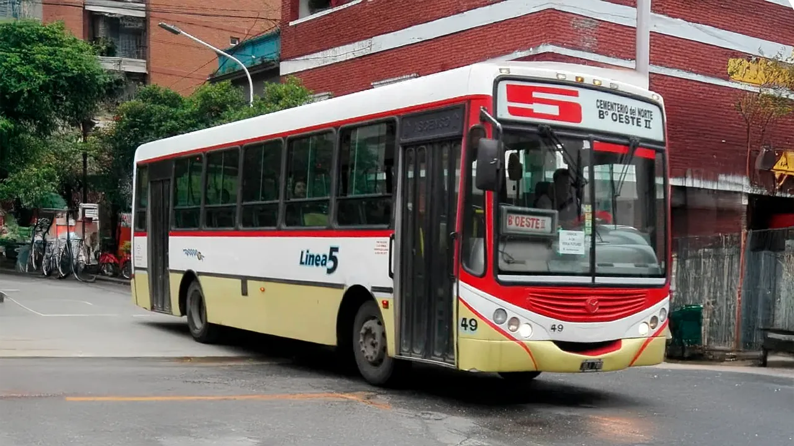

## Linea 5 - Seoc el molino

<p align="center"></p>

### Recorrido

```geojson
{"type":"FeatureCollection","features":[{"type":"Feature","properties":{"name":"Linea 5","direction":"SEOC - El Molino","length_km":15.88,"category":"urbano"},"geometry":{"coordinates":[[-65.1771296175089,-26.80194957254896],[-65.17690431423297,-26.80106652964233],[-65.17754747769892,-26.800936902537362],[-65.17817617493115,-26.800798412208177],[-65.17845161052857,-26.801837584266362],[-65.17910334294119,-26.801698510835664],[-65.17966160114041,-26.801580069679215],[-65.18049148669553,-26.80141210488109],[-65.18094929016183,-26.801316263844473],[-65.18214128264314,-26.801068897379817],[-65.18269414621965,-26.80094585397295],[-65.1837022875422,-26.800741248295008],[-65.18405925525663,-26.800665284998573],[-65.18520631854587,-26.800419516605537],[-65.18583804573636,-26.80028507022343],[-65.18630805404312,-26.800189089783487],[-65.18638430129346,-26.80048648189696],[-65.18665066096106,-26.801553976517265],[-65.18680640205496,-26.802212423408836],[-65.18696717545437,-26.802906804420896],[-65.18567087606968,-26.803184599125927],[-65.18548154960962,-26.803224144703435],[-65.18548583722331,-26.803281360927997],[-65.18578714281378,-26.804554958212876],[-65.18601639752136,-26.805500151436064],[-65.1861815257915,-26.806159827165875],[-65.18633699179335,-26.80681237036071],[-65.18649890289362,-26.807434662705756],[-65.18682906913689,-26.808885915842826],[-65.18753596807346,-26.80873489568642],[-65.18832207046457,-26.80857731275284],[-65.18976290969202,-26.80828731390504],[-65.19120285242343,-26.808018362808582],[-65.1909294455034,-26.80688597300263],[-65.19070590099136,-26.805961565581416],[-65.19050661176036,-26.80512545343276],[-65.19214058129778,-26.80481383997384],[-65.1936953758529,-26.804550143168804],[-65.19518834768735,-26.80429327996147],[-65.19600389276731,-26.804136004298975],[-65.19674739848121,-26.80399258939028],[-65.19748959063249,-26.803846275776607],[-65.1982597874991,-26.803700840942287],[-65.198574180901,-26.80504094807224],[-65.19881123064789,-26.806033563047524],[-65.1988813112331,-26.80636084251608],[-65.19909023191164,-26.80719929037217],[-65.19938238878662,-26.80833059167264],[-65.19958698942249,-26.809222908001964],[-65.19989372168118,-26.81053150416175],[-65.20020288788102,-26.811882382236877],[-65.20051083059485,-26.8132436642564],[-65.20081746092615,-26.814603140975674],[-65.20102970068113,-26.81550923944644],[-65.20109886694847,-26.81579483923322],[-65.2011543095677,-26.81590488674948],[-65.20147198000312,-26.81716697466728],[-65.20178946722928,-26.818619123857047],[-65.20179762722432,-26.818709847169412],[-65.20025965404587,-26.818996280588927],[-65.1988192824509,-26.81926505905522],[-65.19914063026891,-26.82065110493475],[-65.19930149445835,-26.821379820706053],[-65.19946592973093,-26.82206549501501],[-65.19980157971158,-26.82345813631062],[-65.19998436559163,-26.824072134982927],[-65.20020280588122,-26.824805059407847],[-65.20052868249779,-26.82616161829658],[-65.20086338630443,-26.827485152006197],[-65.20228057910353,-26.827256517096853],[-65.2037452298655,-26.826980472503053],[-65.20514927622328,-26.82668125003697],[-65.20475804153955,-26.825297800999532],[-65.20439860261635,-26.823920219159405],[-65.20405925032033,-26.822565163044686],[-65.20379194247727,-26.821363926882064],[-65.2037658033041,-26.82121707053621],[-65.20357200653243,-26.81978535013595],[-65.20344502554673,-26.819125774790812],[-65.20327933869162,-26.818394482997086],[-65.20298257184618,-26.817033964032134],[-65.20294347111708,-26.816882289980953],[-65.20267709312749,-26.815688384502245],[-65.20263521845449,-26.81549068911983],[-65.20255703947446,-26.8152136834736],[-65.20232723021526,-26.814333062908442],[-65.20201312655216,-26.812950678148997],[-65.20170261787825,-26.811579168895182],[-65.20138102158228,-26.810241569083182],[-65.20120589144587,-26.80950958694888],[-65.20108772993835,-26.8089563652426],[-65.20093260410553,-26.808284122332314],[-65.2006194221817,-26.80698907392977],[-65.20033633312083,-26.805844652656212],[-65.20008315559055,-26.804748731695966],[-65.19975038305174,-26.803419333720537],[-65.19959070559975,-26.802732298467234],[-65.19943603975284,-26.802037095985487],[-65.19928099017669,-26.801305859043442],[-65.19914238302577,-26.800631623332134],[-65.19904053053511,-26.800233513088934],[-65.19897187722408,-26.799899040169205],[-65.19889888222735,-26.79956504197219],[-65.19874374540795,-26.798852501248614],[-65.19847995072405,-26.79768243938399],[-65.1983708981021,-26.79719715026898],[-65.19993089905215,-26.796936295916638],[-65.20091011651607,-26.79675833185745],[-65.200627074117,-26.795575755098273],[-65.20043077887023,-26.79477102737017],[-65.2002933196946,-26.794204752783763],[-65.1993356491562,-26.79438607420844],[-65.19779765980937,-26.79467572725927],[-65.19622220600401,-26.794975718615305],[-65.1947122480463,-26.79526876457259],[-65.19313862660835,-26.79557124935565],[-65.19174248717412,-26.79582567764158],[-65.1900931446137,-26.796149757755447],[-65.19028013968662,-26.79687865043929],[-65.19045521693859,-26.79758187299545],[-65.19063312859173,-26.798286995204233],[-65.19077866802961,-26.79891903326463],[-65.19102977132299,-26.8000508003113],[-65.19119087599844,-26.80072603958364],[-65.19135676924063,-26.801402905354035],[-65.19154196237614,-26.80209527435743],[-65.19170976929344,-26.802768927343916],[-65.19186831396021,-26.80343734887356],[-65.192045528864,-26.804232905179553],[-65.19218955446286,-26.804836036970855],[-65.19250122561564,-26.806190523972827],[-65.19093754171817,-26.806485754103715],[-65.19096645095537,-26.806591794470034],[-65.1908238134905,-26.80661983474874],[-65.1894188154475,-26.80688418695034],[-65.18795087916658,-26.80716905861515],[-65.18668904820913,-26.80741952416425],[-65.18649365515599,-26.80745616727776],[-65.18632847323305,-26.806813746566668],[-65.18617003636915,-26.80616248151521],[-65.18600609488051,-26.80550274565156],[-65.18577505310658,-26.80455755520173],[-65.18547643743202,-26.80328330606485],[-65.18547223771039,-26.80321475370819],[-65.18566809669245,-26.803173604812248],[-65.18695678622521,-26.80290048292701],[-65.1867941668704,-26.80221682918725],[-65.18663880021731,-26.801557622368176],[-65.18637348689514,-26.800488260717593],[-65.18630098524197,-26.800198093614185],[-65.18584008278404,-26.800295250625823],[-65.1852099718433,-26.80043002660195],[-65.18406139809382,-26.80067594104943],[-65.18370389481488,-26.800751702829764],[-65.18269471817662,-26.800956505858796],[-65.18214367226173,-26.80107769916863],[-65.18095080776617,-26.801326839379577],[-65.18049473839798,-26.801421564953994],[-65.1796645066265,-26.80159071271162],[-65.17910661087136,-26.801709970711524],[-65.17845496509877,-26.801848534651057],[-65.17759037047718,-26.802031174568086],[-65.17717436564963,-26.802118531252184],[-65.17713441195129,-26.80196246623018]],"type":"LineString"}}]}
```

### Paradas

```geojson
{"type":"FeatureCollection","properties":{"name":"Linea 5 - El Molino"},"features":[{"type":"Feature","geometry":{"type":"Point","coordinates":[-65.17696426434854,-26.801058713557314]},"properties":{"name":"Seoc III y Juan Warnes"}},{"type":"Feature","geometry":{"type":"Point","coordinates":[-65.17801644939098,-26.800804528928392]},"properties":{"name":"Seoc III y Calle SN"}},{"type":"Feature","geometry":{"type":"Point","coordinates":[-65.17840078565365,-26.801548128846868]},"properties":{"name":"Cnel Murga y J I Warnes"}},{"type":"Feature","geometry":{"type":"Point","coordinates":[-65.18026260482544,-26.801396899114476]},"properties":{"name":"J I Warnes y Salas y Valdez"}},{"type":"Feature","geometry":{"type":"Point","coordinates":[-65.18169289944557,-26.801090458871652]},"properties":{"name":"JI Warnes y Salas y Valdez"}},{"type":"Feature","geometry":{"type":"Point","coordinates":[-65.18345095324439,-26.800742302200423]},"properties":{"name":"J I Warnes y Juan Posse"}},{"type":"Feature","geometry":{"type":"Point","coordinates":[-65.185041,-26.800382]},"properties":{"name":"J I Warnes y L  Nougues"}},{"type":"Feature","geometry":{"type":"Point","coordinates":[-65.18662801558519,-26.801440560953264]},"properties":{"name":"Benjamin Villafa�e y Raul R Aragon"}},{"type":"Feature","geometry":{"type":"Point","coordinates":[-65.18574167186173,-26.803182577060554]},"properties":{"name":"Eduardo Wilde y L F Nougues"}},{"type":"Feature","geometry":{"type":"Point","coordinates":[-65.18581101558519,-26.80443174757241]},"properties":{"name":"L F Nougues y Calle SN"}},{"type":"Feature","geometry":{"type":"Point","coordinates":[-65.18623822993156,-26.806106102092887]},"properties":{"name":"L F Nougues y Nougues"}},{"type":"Feature","geometry":{"type":"Point","coordinates":[-65.18649158784966,-26.807326469843776]},"properties":{"name":"L F Nougues y San Salvador"}},{"type":"Feature","geometry":{"type":"Point","coordinates":[-65.18682513236004,-26.808731091925242]},"properties":{"name":"L F Nougues y Nicaragua"}},{"type":"Feature","geometry":{"type":"Point","coordinates":[-65.1881640082116,-26.80860949846287]},"properties":{"name":"Nicaragua y Benjamin Villafane"}},{"type":"Feature","geometry":{"type":"Point","coordinates":[-65.18963442274334,-26.808278260438392]},"properties":{"name":"Nicaragua y C Gutierrez"}},{"type":"Feature","geometry":{"type":"Point","coordinates":[-65.19203030584617,-26.80483165041425]},"properties":{"name":"Mexico y Balcarce"}},{"type":"Feature","geometry":{"type":"Point","coordinates":[-65.19358528095798,-26.804533945606693]},"properties":{"name":"Mexico y Monteagudo"}},{"type":"Feature","geometry":{"type":"Point","coordinates":[-65.1950462998697,-26.804286556510064]},"properties":{"name":"Mexico y Rivadavia"}},{"type":"Feature","geometry":{"type":"Point","coordinates":[-65.19661067060153,-26.804005622474744]},"properties":{"name":"Mexico y Laprida"}},{"type":"Feature","geometry":{"type":"Point","coordinates":[-65.19854616832376,-26.80487777362439]},"properties":{"name":"25 de Mayo y Venezuela"}},{"type":"Feature","geometry":{"type":"Point","coordinates":[-65.19876696539403,-26.80592183036236]},"properties":{"name":"25 de Mayo y Colombia"}},{"type":"Feature","geometry":{"type":"Point","coordinates":[-65.19905353180437,-26.807083279776048]},"properties":{"name":"25 de Mayo y Ecuador"}},{"type":"Feature","geometry":{"type":"Point","coordinates":[-65.19933070259471,-26.80817763097348]},"properties":{"name":"25 de Mayo y Brasil"}},{"type":"Feature","geometry":{"type":"Point","coordinates":[-65.19954210404495,-26.80903717144296]},"properties":{"name":"25 de Mayo y Paraguay"}},{"type":"Feature","geometry":{"type":"Point","coordinates":[-65.19988504417535,-26.810399844199196]},"properties":{"name":"25 de Mayo y Peru"}},{"type":"Feature","geometry":{"type":"Point","coordinates":[-65.20016221496566,-26.811653488669922]},"properties":{"name":"25 de Mayo y Bolivia"}},{"type":"Feature","geometry":{"type":"Point","coordinates":[-65.20048636385603,-26.813058057145145]},"properties":{"name":"25 de Mayo y Chile"}},{"type":"Feature","geometry":{"type":"Point","coordinates":[-65.20078232588638,-26.814470993545132]},"properties":{"name":"25 de Mayo y Uruguay"}},{"type":"Feature","geometry":{"type":"Point","coordinates":[-65.20103130981667,-26.815372412610134]},"properties":{"name":"25 de Mayo e Italia"}},{"type":"Feature","geometry":{"type":"Point","coordinates":[-65.20168993569894,-26.818314493958447]},"properties":{"name":"25 de Mayo y Av Sarmiento"}},{"type":"Feature","geometry":{"type":"Point","coordinates":[-65.19936168118723,-26.819171885786886]},"properties":{"name":"Av Sarmiento y Virgen de la Merced"}},{"type":"Feature","geometry":{"type":"Point","coordinates":[-65.19928378419611,-26.821033407877078]},"properties":{"name":"Virgen de la Merced y Santa Fe"}},{"type":"Feature","geometry":{"type":"Point","coordinates":[-65.19995023623105,-26.823852667339658]},"properties":{"name":"Virgen de la Merced y Corrientes"}},{"type":"Feature","geometry":{"type":"Point","coordinates":[-65.20073786136325,-26.826841778155845]},"properties":{"name":"Virgen de la Merced y Cordoba"}},{"type":"Feature","geometry":{"type":"Point","coordinates":[-65.20310073675986,-26.827081212561705]},"properties":{"name":"Cordoba y 25 de Mayo"}},{"type":"Feature","geometry":{"type":"Point","coordinates":[-65.20453117827076,-26.824507785506597]},"properties":{"name":"Munecas y Santiago"}},{"type":"Feature","geometry":{"type":"Point","coordinates":[-65.20380984882779,-26.821859729572996]},"properties":{"name":"Munecas y Marcos Paz"}},{"type":"Feature","geometry":{"type":"Point","coordinates":[-65.20342716736387,-26.819046088405685]},"properties":{"name":"Munecas y Av Sarmiento"}},{"type":"Feature","geometry":{"type":"Point","coordinates":[-65.20283054549314,-26.81651798617564]},"properties":{"name":"Munecas y Espana"}},{"type":"Feature","geometry":{"type":"Point","coordinates":[-65.20233727544255,-26.814442636230392]},"properties":{"name":"Munecas y Uruguay"}},{"type":"Feature","geometry":{"type":"Point","coordinates":[-65.20201312655216,-26.813063241206333]},"properties":{"name":"Munecas y Chile"}},{"type":"Feature","geometry":{"type":"Point","coordinates":[-65.20173595576183,-26.81168382939752]},"properties":{"name":"Munecas y Bolivia"}},{"type":"Feature","geometry":{"type":"Point","coordinates":[-65.20142120249143,-26.810363100235534]},"properties":{"name":"Munecas y Peru"}},{"type":"Feature","geometry":{"type":"Point","coordinates":[-65.20106886674101,-26.809075898597044]},"properties":{"name":"Munecas y Paraguay"}},{"type":"Feature","geometry":{"type":"Point","coordinates":[-65.20063197041047,-26.80708427117382]},"properties":{"name":"Munecas y Ecuador"}},{"type":"Feature","geometry":{"type":"Point","coordinates":[-65.20036419524014,-26.805973137514428]},"properties":{"name":"Munecas y Colombia"}},{"type":"Feature","geometry":{"type":"Point","coordinates":[-65.20010581568984,-26.80486199296736]},"properties":{"name":"Munecas y Venezuela"}},{"type":"Feature","geometry":{"type":"Point","coordinates":[-65.19978166679942,-26.8035747288797]},"properties":{"name":"Munecas y Mexico"}},{"type":"Feature","geometry":{"type":"Point","coordinates":[-65.19946691352905,-26.802136497975308]},"properties":{"name":"Munecas y Jose M Estrada"}},{"type":"Feature","geometry":{"type":"Point","coordinates":[-65.19918034711868,-26.80077372591727]},"properties":{"name":"Munecas y Don Orione"}},{"type":"Feature","geometry":{"type":"Point","coordinates":[-65.1987904288882,-26.798991614673735]},"properties":{"name":"Munecas y I La Catolica"}},{"type":"Feature","geometry":{"type":"Point","coordinates":[-65.19980045803939,-26.796974650290338]},"properties":{"name":"Emilio Castelar y Maipu"}},{"type":"Feature","geometry":{"type":"Point","coordinates":[-65.20064136603037,-26.795670523252053]},"properties":{"name":"Junin y Madrid"}},{"type":"Feature","geometry":{"type":"Point","coordinates":[-65.19950919381904,-26.794391541660318]},"properties":{"name":"Av Fransisco de Aguirre y Maipu"}},{"type":"Feature","geometry":{"type":"Point","coordinates":[-65.19639454578532,-26.794924102960273]},"properties":{"name":"Av Francisco de Aguirre y 25 de Mayo"}},{"type":"Feature","geometry":{"type":"Point","coordinates":[-65.19326110651163,-26.795506982147554]},"properties":{"name":"Av Francisco de Aguirre y Rivadavia"}},{"type":"Feature","geometry":{"type":"Point","coordinates":[-65.19194102190006,-26.795787937232923]},"properties":{"name":"Av Francisco de Aguirre y Monteagudo"}},{"type":"Feature","geometry":{"type":"Point","coordinates":[-65.19031088182811,-26.796110825053823]},"properties":{"name":"Av Francisco de Aguirre y Balcarce"}},{"type":"Feature","geometry":{"type":"Point","coordinates":[-65.19041893145823,-26.797414947030532]},"properties":{"name":"Balcarce y Madrid"}},{"type":"Feature","geometry":{"type":"Point","coordinates":[-65.19076187158862,-26.79878614593013]},"properties":{"name":"Balcarce y Emilio Castelar"}},{"type":"Feature","geometry":{"type":"Point","coordinates":[-65.19115178981905,-26.800601805817546]},"properties":{"name":"Balcarce y I La Catolica"}},{"type":"Feature","geometry":{"type":"Point","coordinates":[-65.19153231242949,-26.801972966192867]},"properties":{"name":"Balcarce y Delfin Gallo"}},{"type":"Feature","geometry":{"type":"Point","coordinates":[-65.19182827445981,-26.803310565386997]},"properties":{"name":"Balcarce y Jose M Estrada"}},{"type":"Feature","geometry":{"type":"Point","coordinates":[-65.19213363211017,-26.804597832473192]},"properties":{"name":"Balcarce y Mexico"}},{"type":"Feature","geometry":{"type":"Point","coordinates":[-65.19248042335022,-26.805982473999187]},"properties":{"name":"Balcarce y Venezuela"}},{"type":"Feature","geometry":{"type":"Point","coordinates":[-65.1910646642496,-26.806459367756805]},"properties":{"name":"Venezuela y Av Juan B Justo"}},{"type":"Feature","geometry":{"type":"Point","coordinates":[-65.19087934239482,-26.806731072546352]},"properties":{"name":"San Salvador y Av Juan B Justo"}},{"type":"Feature","geometry":{"type":"Point","coordinates":[-65.18959804963015,-26.806873736506304]},"properties":{"name":"San Salvador y C Gutierrez"}},{"type":"Feature","geometry":{"type":"Point","coordinates":[-65.18815864234965,-26.80715120927955]},"properties":{"name":"San Salvador y Benjamin Villafane"}},{"type":"Feature","geometry":{"type":"Point","coordinates":[-65.18668904820913,-26.80741952416425]},"properties":{"name":"San Salvador y L F Nougues"}},{"type":"Feature","geometry":{"type":"Point","coordinates":[-65.18632207153009,-26.80689218955817]},"properties":{"name":"L F Nougues y C 39"}},{"type":"Feature","geometry":{"type":"Point","coordinates":[-65.18602730218998,-26.805651368742737]},"properties":{"name":"L F Nougues y C 41"}},{"type":"Feature","geometry":{"type":"Point","coordinates":[-65.18582348905002,-26.80463896513734]},"properties":{"name":"L F Nougues y Calle SN"}},{"type":"Feature","geometry":{"type":"Point","coordinates":[-65.18543536788982,-26.803372589278375]},"properties":{"name":"L F Nougues y Eduardo Wilde"}},{"type":"Feature","geometry":{"type":"Point","coordinates":[-65.186592,-26.802975999999997]},"properties":{"name":"Eduardo Wilde y Benjamin Villafane"}},{"type":"Feature","geometry":{"type":"Point","coordinates":[-65.18667890656998,-26.801654626549617]},"properties":{"name":"Benjamin Villafane y Raul R Aragon"}},{"type":"Feature","geometry":{"type":"Point","coordinates":[-65.18521599999997,-26.800427]},"properties":{"name":"JI Warnes y L F Nougues"}},{"type":"Feature","geometry":{"type":"Point","coordinates":[-65.18391518245078,-26.800739784433034]},"properties":{"name":"JI Warnes y Juan Posse"}},{"type":"Feature","geometry":{"type":"Point","coordinates":[-65.18164929195054,-26.801200943796168]},"properties":{"name":"JI Warnes y Salas y Valdez"}},{"type":"Feature","geometry":{"type":"Point","coordinates":[-65.179143,-26.801729999999996]},"properties":{"name":"JI Warnes y Jose Hernandez"}}]}
```

### Editar en [`geojson.io`](https://geojson.io/#map=11/-26.8139/-65.2008)

- [recorrido.v2.geojson](https://geojson.io/#data=data:text/x-url,https%3A%2F%2Fraw.githubusercontent.com%2FFrancoJavierGadea%2FTucuman-colectivos%2Frefs%2Fheads%2Fmain%2Fdata%2Furbano%2F5%2Fseoc-el-molino%2Frecorrido.v2.geojson)

- [recorrido.geojson](https://geojson.io/#data=data:text/x-url,https%3A%2F%2Fraw.githubusercontent.com%2FFrancoJavierGadea%2FTucuman-colectivos%2Frefs%2Fheads%2Fmain%2Fdata%2Furbano%2F5%2Fseoc-el-molino%2Frecorrido.geojson)

- [paradas.geojson](https://geojson.io/#data=data:text/x-url,https%3A%2F%2Fraw.githubusercontent.com%2FFrancoJavierGadea%2FTucuman-colectivos%2Frefs%2Fheads%2Fmain%2Fdata%2Furbano%2F5%2Fseoc-el-molino%2Fparadas.geojson)